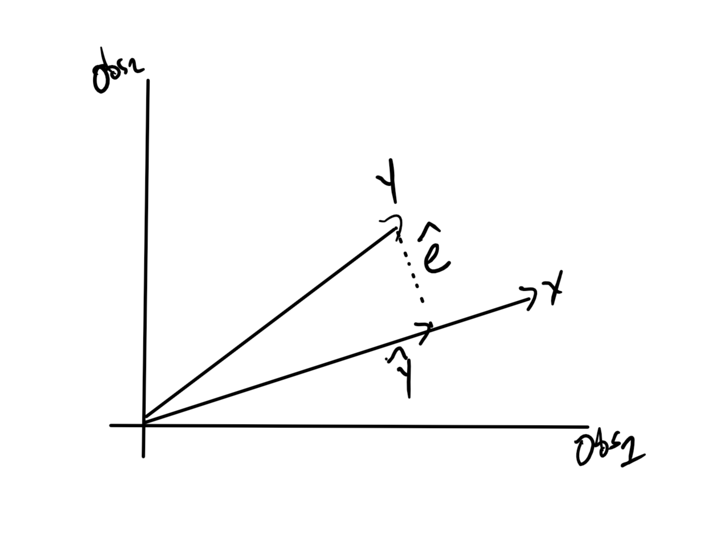

```{r setup, include=FALSE}
knitr::opts_chunk$set(echo = FALSE)
```

# Warnings  

+ This is about one of handing endogeneity  of dependent variables.
+ This is about one  tool that can be used to establish causality.
+ It is not comprehensive
+ I take shortcuts and don't address some technical cases.


# Ordinary Least Squares

$$y  = \alpha + \beta_1 x_1  + \beta_2 x_2 + \epsilon$$


+ y is often called the left-hand side, endogenous variable, or the variable who's variation we are trying to explain.  
+ The xs are called the right-hand side or exogenous variables.
+ $\epsilon$ is often called the error term.
+ There are whole families of statistical assumptions that make OLS or ML estimates work.

We will focus on this one:

$$cov(x, \epsilon) =0$$

This translates into the idea that the errors and the exogenous variables have to be independent (Yes, independence is a bigger idea but ...)

# How can they be not independent?

+ Many ways, but the one we are looking at is that one or more of the RHS variables is determined by the interaction with some other regression equation.

# Why IV?

Suppose you have observations of prices and the amount sold in a market.


# You could see this as 

+ Stable demand $Q_S = \alpha + \beta Price + \epsilon$
    + Remember you choose quantities based on price.
+ Supply bounces around to give you the dots, your observations.

The problem is that price is determined by both supply and demand

# Reality


# Notice

You can't be sure that the slope of the demand function is the same as the gross response.
Price is endogenous, created by the interaction of supply and demand.

+ How do you estimate both?
    + Lots of multiple equations models where you have to specify all the equations.
    + IV is a 'single equation method' that avoids having to know all those functional forms
+ Instrumental variables is common (Note I added Income to this model)
    + Have a model for demand $Q_D = \alpha + \beta_1 Price + \beta_2 Income + \epsilon$
    + And a model for supply but that model needs one  extra thing to make it different enough to identify  $Q_S = \alpha + \beta_1 Price + \beta_2 Wage~Rate + \epsilon$
    + You don't actually estimate the supply equation buy it gives support to why you chose the variables you did as an instrument.

There are many technical conditions but "leaving out one or more" is easy one to remember.

# What are you looking for in instruments?

+ It/they, z, should be correlated with the endogenous RHS variable $cov(z,x) \neq 0$
+ The instrument should not be correlated with the error terms $cov(z, \epsilon) = 0$
+ You need to have a real, physical reason for making that claim.
+ A regression that explains the RHS endogenous variable, all the other RHS variables plus the instruments, $Price = \alpha + \beta_1 Wage~Rate +  \beta_2 Income + \epsilon$ should be strong, F of 10, some say 15, or better.

# IV as  2sls Thought Process


+ First Equation regress your remaining RHS variables and instruments on the endogenous variables. $Price_t = \alpha + \beta_1 Wage~Rate_t +  \beta_2 Income_t + \epsilon+t$.
+ Put the forecasted endogenous variables, $\widehat{Price}_t$, in place of the observed endogenous variables, $Price_t$.
+ Run the equation with the new data $Q_{D,t} = \alpha + \beta_1 \widehat{Price}_t + \beta_2 Income_t + \epsilon_t$
+ Inflate the $var(\widehat{\beta_1})$ which is understated because you pretend you know $\widehat{Price}_t$ with certainty and the  OLS estimator  does not work.

# The Actual IV estimator

For the linear case OLS is:
$$\beta_{OLS} = \left( X'X \right)^{-1} X'Y$$
For linear IV it is:
$$\beta_{OLS} = \left( Z'X \right)^{-1} Z'Y$$

# Variance

OLS estimates have a variance of
$$var(\beta_{OLS}) = s^2 \left[ X'X \right]^{-1}$$
IV Variance includes the instruments

$$var(\beta_{OLS}) = s^2 \left[ X'(Z(Z'Z)^{-1}Z'     )      X \right]^{-1}$$
The gunk in the middle, $Z(Z'Z)^{-1}Z'$ is a projection,$Pr$, or hat matrix.  It turns data into its estimated values.

# Projection or Hat Matrix

$$\beta_{OLS}=(X'X)^{-1}X'Y$$
Multiply by $X$ to give

$$\hat Y = X \beta_{OLS} = X(X'X)^{-1}X'Y = Pr Y$$
It turns observed into estimated.

# Projection matrices are funny

+ They are symmetric $Pr = Pr'$
+ They are idempotent $Pr Pr' = Pr$
+ $Pr X = X(X'X)^{-1}X'X = X$

# Algebra Details

For OLS you are solving this problem

$$\min_{\beta} (Y - X \beta )'(Y - X\beta )$$

Maximizing this gives

$$\beta_{OLS} = \left( X'X \right)^{-1} X'Y$$

# You will do that in econometrics, but if you are curious.

$$\min _{\beta} Y'Y - X'\beta'Y - Y'X\beta + (X\beta)'(X\beta)$$
$$ \frac{\partial}{\partial \beta} :  - X'Y - Y'X  + 2(X'X)\beta = -2 X'Y + 2(X'X)\beta $$

$$X'Y = (X'X)\beta$$
$$\beta = (X'X)^{-1}X'Y$$

# Back to IV

But lets pull that apart.  Note that $Y = X\beta + \epsilon$.

$$\beta_{OLS}=\left( X'X \right)^{-1} X'Y = \left( X'X \right)^{-1} X' (X \beta + \epsilon) $$

The $X'X$ terms cancel out to give

$$ \beta_{OLS} = \beta + X' \epsilon$$
$X' \epsilon$ is zero when $cov(x,\epsilon)$ but it isn't, i.e., the reason we are using IV, endogenaity. 

# How to fix?

The first stage regression is a "projection" onto the instruments. OLS is also a projection.




# Algebra

First project the X variables onto the Z variables to get, $\hat x$ then project the y variable onto  $\hat x$ to get $\hat Y$ with the usual least squares method.

$$\min_{\beta} (Y - Pr X \beta )'(Y - Pr X\beta )$$

$$\min _{\beta} Y' Y - Pr X'\beta' Y -  Y' Pr X\beta + (Pr X\beta)'(Pr X\beta)$$
Now take the derivative like before

$$ \frac{\partial}{\partial \beta} :  - Pr X'Y -  Y' Pr X  + 2 (Pr' X' Pr X)\beta = -2 Pr' X'Y + 2(Pr'X' Pr X)\beta $$

# Now the black magic

+ Start with  $\beta_{IV} =  (X' Pr X )^{-1}  X' Pr Y$.
+ Remember that $(AB)^{-1} = B^{-1} A^{-1}$
+ Swap in the definition of the projection matrix
$$beta_{IV} =  (X' Z'(Z'Z)^{-1}Z' X )^{-1}  X' Z'(Z'Z)^{-1}Z' Y$$
+ Then use the AB trick
$$(Z'X)^{-1}(X'Z'(Z'Z)^{-1})^{-1} X' Z'(Z'Z)^{-1}Z' Y$$
+ Work the inverses
$$(Z'X)^{-1}(Z'Z)(X'Z')^{-1} (X' Z')(Z'Z)^{-1}Z' Y$$
+ Then cancel from the inside out to get $\beta_{IV} = \left( Z'X \right)^{-1} Z'Y$


# Warnings

+ If you have one instrument, you can't test the $cov(z, \epsilon) = 0$ assumption.  The math forces it happen.
+ If you have more than one, Sargon's J Test, can check the condition but you must assume the $cov(z, \epsilon) = 0$ condition holds for one of the instruments.
+ "J Test" indicates a regression based  test.  There are a lot of them.
  
# Sargon's J  

+ Start with your model $y = \alpha + \beta_1 x_1 + \beta_2 x_2 + \epsilon$ and instruments $z_1$ and $z_2$.
+ Get your IV estimates $y = \widehat{\alpha_{IV}} + \widehat{\beta_{1,IV}} x_1 + \widehat{\beta_{2,IV}} x_2 + \widehat{\epsilon_{IV}}$.
+ Regress the instruments plus a constant on the IV residuals, $\widehat{\epsilon_{IV}} = \delta_0 + \delta_1 z_1 + \delta_2 z_2$ 
+ Note that a small $R^2$ is good.
+ The test $NR^2 \sim \chi^2_k$.  N is the number of observations.  k is the number of instruments  less endogenous variables.  In this case $\chi^2_1$
+ Rejecting the null, instruments are not  correlated with IV errors, means that at least one of the instruments are endogenous.  
+ Note that if it fails, you don't know  which one is bad.

# Ok, thats the stats

+ The remainder of the support for the instruments is a logical argument.
    + You need to have a story of why the instrument is correlated with the RHS endogenous variable but not LHS.
    + Missing variable bias is a thing with instruments too, so don't leave a variable out.
+ Look at the first stage regression.  Do the parameter estimates make sense?
+ Try other instruments.
    + If they pass the logic and Sargon's J over identification test.
    + and they give similar results, you look good.
    + Try some bad ones too.
    
    
# Be conservative in interpretation of  significance

+ IV estimates are consistent but always biased.
+ Hahn Hauseman (2005) Bias $E(\beta^{2SLS}_1) - \beta_1 \approx \frac{lp ( 1- \tilde{R}^2)}{n \tilde{R}^2 }$
    + More instruments, l, more bias
    + Higher first stage $R^2$ less bias.
    + More correlation between endogenous and error, $|\rho|$ more bias.
    + More observations, n, less bias
+ In Other Words (IOW) -- if the first stage $R^2$ is high, you have a minimal set off  instruments and plenty of observations, go nuts.
+ Otherwise, envision your p-values on your parameter estimates as lower.
+ Random suggestion, try bootstrapping the errors.
