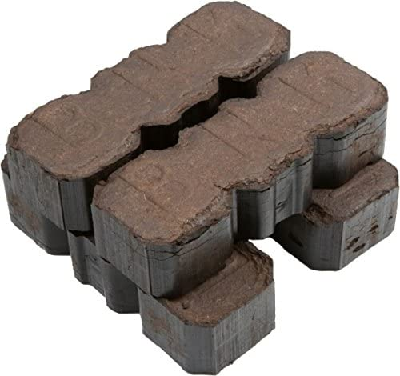
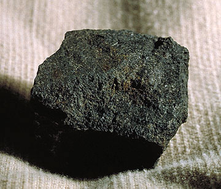
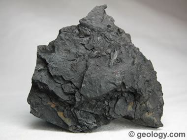
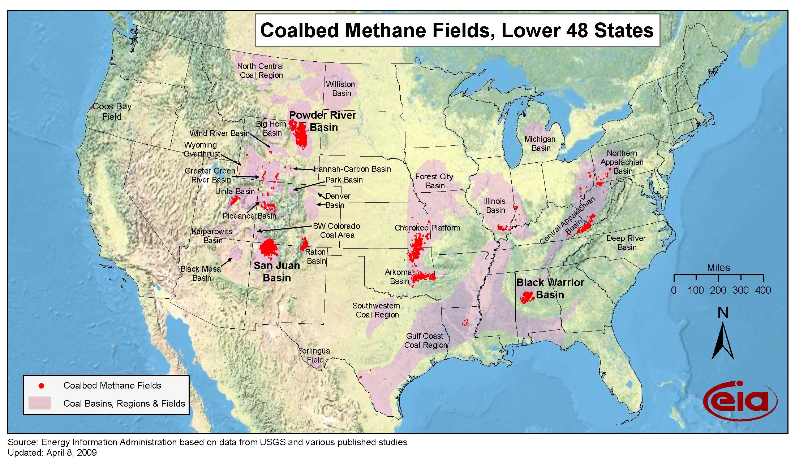
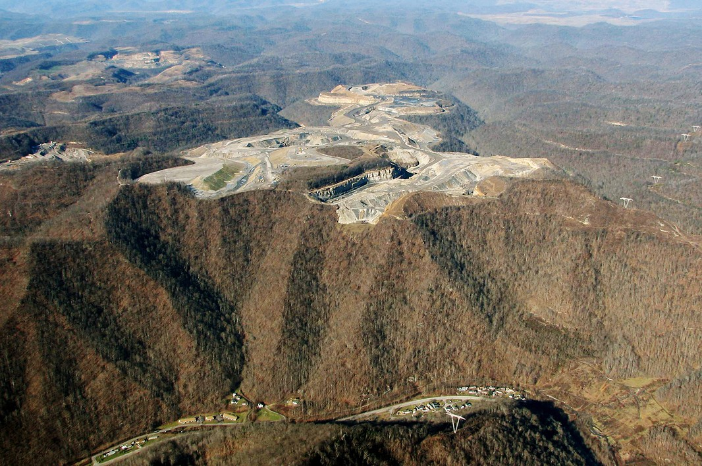
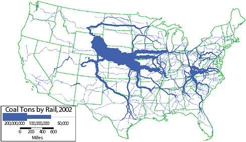
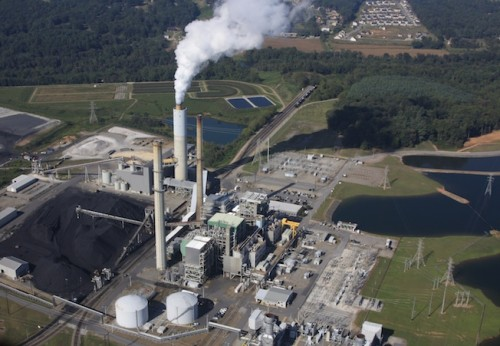

```{r setup, include=FALSE}
knitr::opts_chunk$set(echo = FALSE)
```

# What is Coal?

+ Start with boggy land.
+ The decaying plants turn into peat.
+ The peat gets buried
+ Over  time, millions of years, turns into coal.
+ More time and more pressure (most of the time deeper), better coal.

Better means higher carbon content and BTU/lb


# What are the Kinds of Coal?

In general, the deeper the coal the older it is and the more likely it is higher quality. The names vary by country and the number of grades (ranks) differs by country.

+ Anthracite: Highest quality
+ Bituminous
+ Sub-Bituminous
+ Lignite: Lowest quality

# Coal is often separated into two major groups.

+ Metallurgical Coal: Expensive and almost pure carbon, used to make steel.  
    + Coke, which is cooked coal, like charcoal is cooked wood, is  a frequent substitute.
+ Steam Coal: Used in electricity production.
    + "Steam Coal" is  different depending  on the country.
    
# Pictures: Peat



# Pictures: Anthracite


# Pictures: Bituminous


# Pictures: Lignite



# Heat Content, Sulfur, Carbon.

+ Heat content, kJ/kg or  BTU/lb in merican, varies a little bit within category.  
    + 1 BTU = 1.055 kJ
    + 1 BTU is enough to raises one lb of water 1 F.
    + EIA swaps from BTU/ton to BTU/lb frequently.  
    + (short) ton = 2000 lbs
+ Sulfur can vary widely but except for lignite is less than 1%.  This is a pollutant.
+ Carbon content virtually defines the ranks.

# The Numbers

Type    | Carbon%   |BTU/ton    |
-----   |-----      |-----      |
Lignite |30%        |10M -15M   |
Sub-Bituminous|40%  |16M -20M   |
Bituminous| 50%-70% |22M -30M   |
Anthracite| 90%+    | 28M+      |


# Where do you find it in the US?



# How do you mine it?

+ Surface (Most common in US)
    + Open Pit
    + Strip -  Take the overburden off, then it is like double digging in your garden.  Common in Western US coal mining
    + Contour - Like strip for hills
    + Mountaintop removal - Get coal off from under mountain top and throw it into the valley. An Appalachian thing
+ Underground mining
    + 1000s of feet deep and for miles.
    + Various techniques: Long wall, room and pillar.
    
# Mountaintop Removal



# Underground Fires

+ Coal fires are a thing.  The most famous US fire is Centralia, which started in 1962.
+ The most famous world wide is Mt Wingen in  New South Wales, which has been burning for 6,000 years.
+ There are a few thousand burning at any given moment.
    + Besides CO2 and SOX
    + Mercury

# How is it transported?

+ Railroads  68.7% of the domestic coal
+ River Barge  11.9%
+ Truck about 10.5% 
+ Tramway, Conveyor, and Slurry pipeline accounted for 8.9%. (Short distance)
source: https://www.eia.gov/coal/distribution/annual/

Keep in mind that transportation is often more expensive than mining.

# Rail Map



# A few comments on the map

That huge wave coming out of Wyoming wasn't there till the 90s.

+ That is Powder River
+ It has low sulfur and was not used until SOX controls on power plants were required in 1990.
+ Tends to be cheap
  + BLM land
  + Auctions on mining rights almost always had one bidder.
  + Those mining rights are a current topic.

# Burning Coal is a tradeoff

+ If you burn at high temperatures
    + You get lots of kWh per BTU
    + Generate more NOX and SOX
+ If you burn at lower temperatures
    + You get less kWh per BTU
    + Less NOX and SOX
    + More particulates PM 10 and PM 2.5

You either start with low sulfur coal, burn at lower temperature or scrub after.  Trade-offs depend on prices and technology.

# Why coal?

Historical point of view:

+ Coal burns hotter than wood, but so does charcoal.
+ Coal (anthracite) burns with less ash and smoke than wood, but so does charcoal.
+ Charcoal requires a lot of wood to make.

We could not keep up with heating and steel demand.  The first industrialized countries had good (anthracite) coal with low transportation costs.

# We tried with wood and Hydro

+ The UK and US killed a lot of trees to keep up.
+ UK would have run out of mill sites by 1830.
+ Even used intensive management like pollarding to produce more wood.

{ width=50% }

# Metalurgical Uses

+ You need carbon, and other things, to turn iron into steel.  
+ You also need carbon to smelt iron.
+ You need a lot of energy to do this.
+ Metallurgical coal is ~ \$200/ton.  Steam coal is <\$50/ton.


# Electrical Generation from the outside


Source: http://appvoices.org/images/uploads/2012/02/Asheville-coal-plant-e1432059203783.jpg

# Coal on the inside

+ Pulverize the coal, picture something that can do 20 Tons/hr
+ Blow it into combustion chamber to burn
+ Steam turns turbine, etc. https://youtu.be/IdPTuwKEfmA

+ Clean up
    + NOx with ammonia common but plenty of others
    + Recover fly ash and sell it, great for concrete.
    + SOx, Mercury and other.  BTW Radiation


