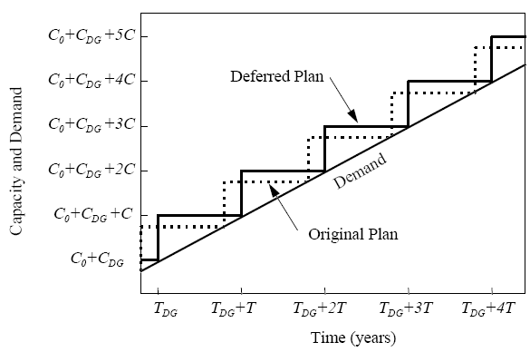
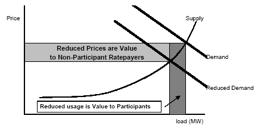

```{r setup, include=FALSE}
knitr::opts_chunk$set(echo = FALSE)
```

## DER vs DG

+ DG = Distributed Generation
+ DER = DG + Storage

May seem like semantics but small storage grew in potential since 2005

##  What is in DER

+ Definitions vary but Small (< 49MW) generation seems to count with < 1MW most common.
    + Plenty of renewable
    + Small turbine
    + Backup generators
    + Battery banks.
+ Combined Heat and Power
    + Steam Generation
    + Chill Water
    + District Energy
    
## Why Would I (Private) Build It?

+ Power Quality
    + Equipment is sensitive to voltage drops or spikes
    + Equipment is sensitive to frequency variation.
    + Wave shape and harmonics
    + High reactive power needs (Often avoids utility charge.)
    
+ Reliability (Often combined with quality)
    + High cost of interrupted power, e.g., hospital
    + Two common measures 
        + System Average Interruption Duration Index (SAIDI), average total time without power over a year.
        + Customer Average Interruption Duration Index (CAIDI), average time without given your power is out.
        + Many more relating to frequency and cost of lost service.
    + You could have lower rates if you have an interruptible tariff.    


## Why Would I (Private) Build It? (Cont)

+ Peak reduction
    + If you have demand (kW) charges, your maximum use.
    + If you have a coincident peak (kW) charge, you use at system peak.

+ Cogeneration Opportunity
    + Already need Steam or Chill water
    + Electricity generation is a bonus
      
+ Reduction in volumetric (kWh) charges
    + Net metering just a bit to shave off the high block charges
    + Peak Pricing Tariff
    + Real-time Prices.
    + Nice subsidy.
    + Actually, social cost, cheaper.
    
+ The utility side is significantly more complicated.


## Why The Controvoursy

+ Limited markets for local reactive power.
+ Limited markets for local reliability.
    

## Three simple ways of thinking about costs

+ The Make vs Buy trade-off (TC).
+ The Minimum Efficient Scale (AC), i.e., volume such that AC is at a minimum.
+ Investment Delay, a time value of money concept.

With all cost estimates the key conceptual problem is to only look at incremental costs.

+ It is often unclear what those incremental costs are relative to.  
+ Cost does depend on your point of view.

## Example Make vs Buy

+ Assume cost functions of $C = F + \alpha q$ form.  
    + Fixed cost
    + Constant average variable cost
+ Make vs Buy:  Given known q, Choose the least cost technology 

## Example MES

+ Several definitions of MES
    + Quantity such that $MC=AC$.
    + Quantity such that AC decreases very little as quantity increases.

## Example Investment Delay

+ Pushing costs into the future can be valuable.
+ Value of delay increases as interest rates increase.
+ Exponential discounting $P = \frac{F}{(1+i)^N}$.


+ Example:  Maintenance expenditures of $100 a year forever. What is the value of skipping a year?
    + $PW(Maintance) = \frac{100}{i}$ At i = 10% this is `r 100/.1`.
    + Delay for 1 year is $\frac{\frac{100}{i}}{1+i}$. This is `r round((100/.1)/1.1,2)`. 
    + The difference is the savings.

## Report Example



## How Did We Get to the Current G-T-D Arrangment (MES Argument)

+ Both large scale and small scale originally existed.
+ Large scale developed
    + Lower AC
    + Higher MES
    + Speed of change up till 60s made this the dominant form.
+ Small scale continued to develop
    + Right sized scale and MES
    + Decreasing AC
    + 1978 Qualifying Facilities Era was when they could sell power under some conditions.

## Private Choice of Technology (Make vs Buy Argument)

+ Have access to utility power and DG.
+ Several States of Opportunity Costs
    + If you have no special needs and need to pay full cost of fuel.
    + If you have 'Free' access to fuel, e.g., wood chips, AC of DG is lower.
    + If power quality or interruption is not what is desired, AC of utility power is higher.
    + If you face a Peek, Time of Use or Demand Charge.
    + More complicated diagrams can be made but this works.

    
    
## Utility Point of View 

Please note that lots of power quality issues need to be solved on the D side, with capacitors and transformers. Power quality may actually get worse with new equipment and DG.

+ Utility: Supply customer needs with T+G or with DG. Trade-offs between the two in an isoquant/isocost sense.
+ Customer: Decide to take utility solution or provide with private DG. (Make vs Buy).

# Odd Diagrams and Points in the Report

## Fig 3-4


## What is Wrong?

+ Need two diagrams, one for constrained DG and one for wholesale electricity market
+ Confuses Reduced usage is Value to Participants with utility cost reductions and reduction in DWL.

## Fig 3-7

+ Gives perfect competition result for a competitive public utility.
+ Somehow, it can be rate of return regulated.
+ Analysis should be that of a price ceiling with a reduction in demand and a reduction in the ceiling.

## What is going on NOW

By NOW I mean in the last month/week.  Comments are rough because it is all very new.

+ Proposed rule for virtual power plants, though not by that name, as well as new definitions so DER can participate at the wholesale level. (Nov 17, 2016)
    + https://www.ferc.gov/whats-new/comm-meet/2016/111716/E-1.pdf
    + CAISO has had them for a few years http://www.caiso.com/Documents/Non-GeneratorResourceRegulationEnergyManagementImplementationPlan.pdf
+ New York is on the topic too. (Oct 27th, 2016) http://documents.dps.ny.gov/public/Common/ViewDoc.aspx?DocRefId={59B620E6-87C4-4C80-8BEC-E15BB6E0545E}

## The FERC NOPR is *very* political  

+ Appears timed to be in place before the FERC board turnover in January.
+ There is a procedure for rule making that involves months of notice and hearings.
+ Undoing requires doing this again.

##  The FERC Proposal

+ Elimination of Barriers to Electric Storage Resource Participation in
Organized Wholesale Electric Markets.

+ Participation of Distributed Energy Resource Aggregator in the
Organized Wholesale Electric Markets


## The Barriers

Please note that many market definitions vary by ISO/RTO.  FERC gives directions.

+ Rules are set up to accommodate existing technology:
    + How long they can provide service
    + How they provide service
    + Often restricted to regulation service 

+ Examples
    + ISO-NE requires registered Generator Assets to participate in all wholesale markets
    + Common vision of storage is pumped storage with under an hour use.

+ Some RTO/ISOs are better
    + PJM Energy Storage Resource Model
    + CAISO Energy Storage Resource model
    
+ But all are found wanting by their *own* assessment.    

## Connection to Demand Response

Demand response is typically:

  + Things done on the consumer side of the meter
  + Remote turn of of equipment
  + Agreements to turn off with notice
  + Getting paid for not consuming electricity
    
The reason is that demand response is considered a residual definition, if not generation then demand response.

## Virtual Power Plants, aka, Aggregators

+ Typically there is a minimum size to participate in the wholesale markets.  Minimum size is defined by the unit.

+ Aggregation allows you to combine many small units and operate them as one large unit.

+ Common practice
    + Banks are savings aggregator
    + Corporations are investment aggregators to accommodate small investments.


## The FERC Proposal

+ Electric storage resources must be eligible to provide all capacity, energy and
ancillary services that they are technically capable of providing in the organized
wholesale electric markets;

+ The bidding parameters incorporated in the participation model must reflect and
account for the physical and operational characteristics of electric storage
resources;

+ Electric storage resources can be dispatched and can set the wholesale market
clearing price as both a wholesale seller and a wholesale buyer consistent with
existing rules that govern when a resource can set the wholesale price;

+ The minimum size requirement for electric storage resources to participate in the
organized wholesale electric markets must not exceed 100 kW; and

+ The sale of energy from the organized wholesale electric markets to an electric
storage resource that the resource then resells back to those markets must be at the
wholesale LMP.


## Commentary Bidding Parameters

+ Not just about storage.  This is aiming for technology neutrality.

+ Bidding parameters could include things like state of charge
    + Like CAISO and NYISO.
    + MISO is more detailed requiring hourly max levels, storage rates,etc.
  
+ Proposal is: "RTOs/ISOs establish state of charge, upper charge limit, lower charge limit, maximum energy charge rate, and maximum energy discharge rate"

    
## Commentary (Con't)

+ Balance between the additional costs and complexity to the ISO/RTOs and the benefits of technological development
    + Makes it harder to manage the grid.
        + NG that has connection to pipeline and backup diesel is easier to optimize than battery with limited storage.
        + It literally increases the mathematical difficulty and will require new models.  Basically, convert to pumped storage model.
    + May produce "Gresham's law"" power with increased market monitoring costs. 
    + New technology does not get developed unless there is a way for it to make money.
    
+ Spinning Reserves requires spinning, but batteries don't spin.

## Commentary, Buyer and Seller

+ Some existing limitations
    + MISO in real-time market but as demand response
    + NYISO as negative prices on generation side with other restrictions.
    
+ This is a proposal to submit bids as both a buyer and a seller in the same period.
    + Makes sense since this is a special feature of storage but;
    + ENRON did some manipulation of congestion pricing with this.  They did it through wheeling but there may be a dynamic analog.
    
## Commentary on size

+ Smaller than *most* ISO/RTO, CAISO is low with 10kW
+ 100kW puts high-end Teslas on the list.
+ 100kWh Powerpack, at $145K, with $52K inverter buys in.
+ Most DER is under this but with the aggregation rules, may not be an issue.


## No Arbitrage Rule or is it?

+ Avoids people buying at wholesale and then net metering.
    + I bet there is a way around this!
    + But they used the distribution network to get the power.
    
+ Need new rules for a firewall between the retail and wholesale markets.
    + Can I buy wholesale (G+T) to avoid retail (G+T+D)?
    
This will be where the next round of trouble will be.  How will the load serving entity, i.e., the utility survive?

## Aggregation, Virtual Power Plants

+ Idea
    + Get a bunch of small DER together.
    + Contract to control market interactions subject to limitations.
    + Pay them for their power/storage
    + Take a slice.

+ CAISO idea as far as I can tell but others have done it.
    + Was usually just demand response, i.e., getting paid for not using power.
    + NYISO puts limitations on the size of the individual units, less than 10kW.
+ Would allow more behind the meter storage, think PV to participate, but currently many limitations on them injecting power.


## Why this is really interesting.

+ LMP don't often provide the right incentives for new generation.
    + Prices are high now but
    + Once you enter, prices would be low.
+ This allow you to build a power plant for an area a bit at a time.
+ May offset some smart grid costs, the generator pays rather than the Load Serving Entity.
+ Connects with making the nodes as broad as possible to increase competition.

