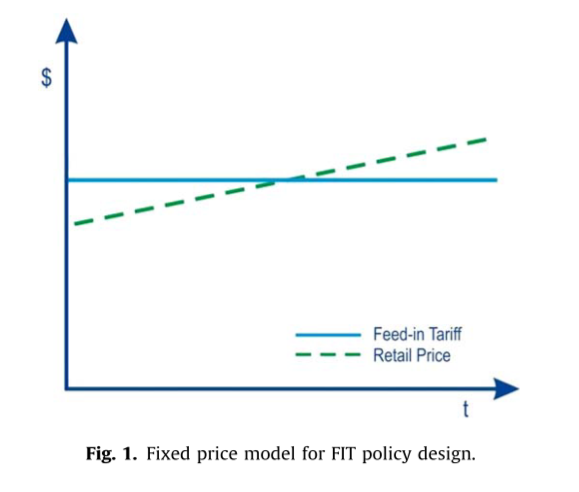
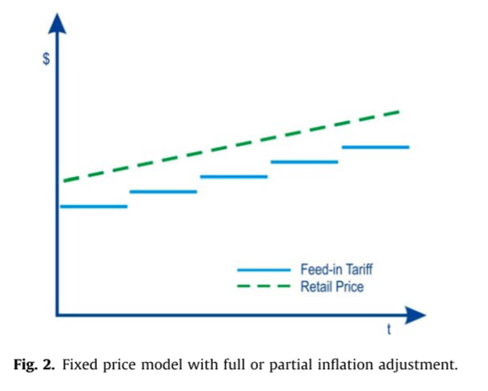
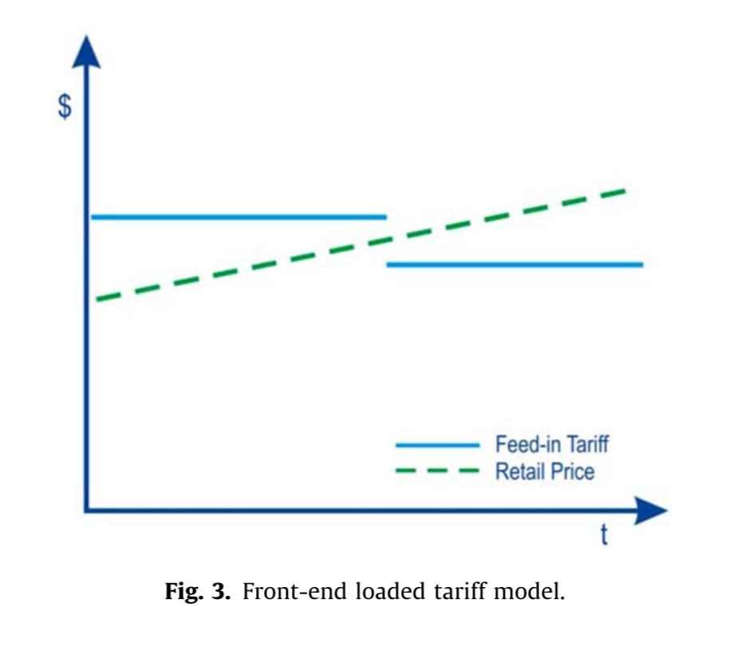
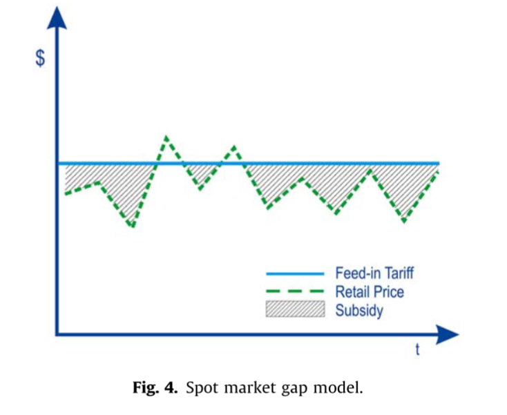
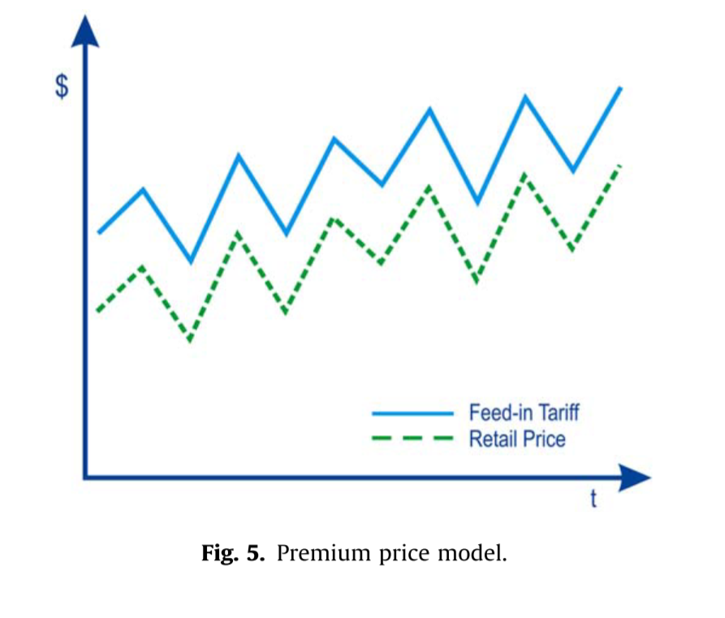
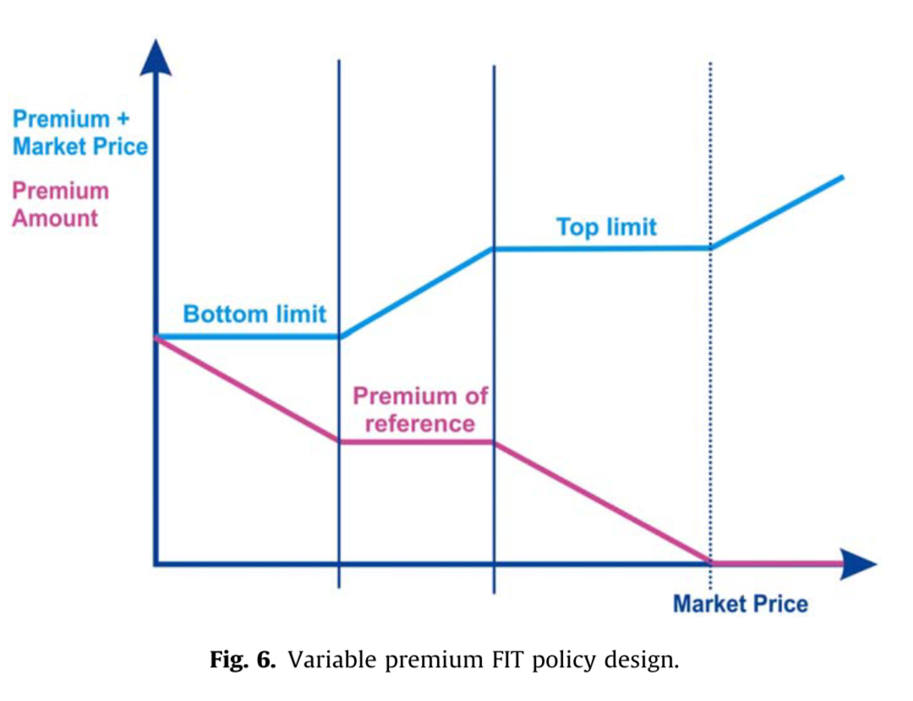
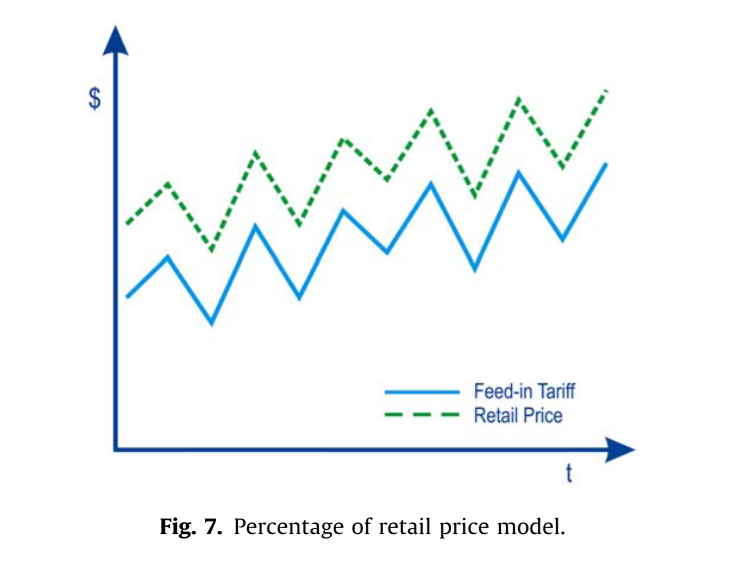

```{r setup, include=FALSE}
knitr::opts_chunk$set(echo = FALSE)
```

# Discussion of

Couture, Toby, and Yves Gagnon. "An analysis of feed-in tariff remuneration models: Implications for renewable energy investment." Energy policy 38.2 (2010): 955-965

#



#



#



#


#


#


#

