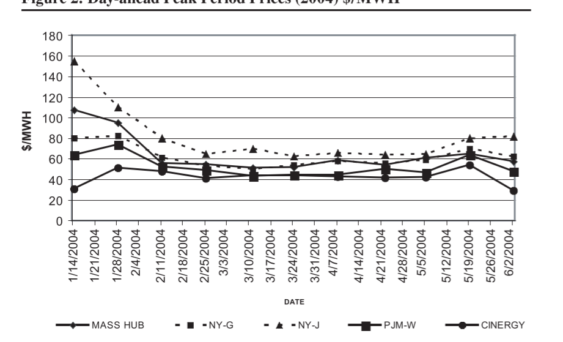
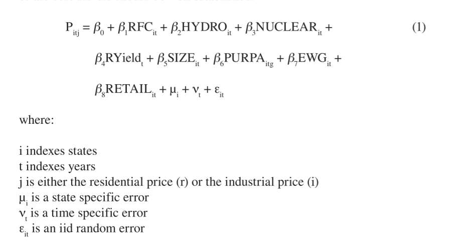
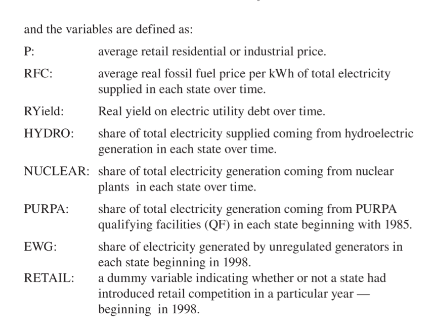
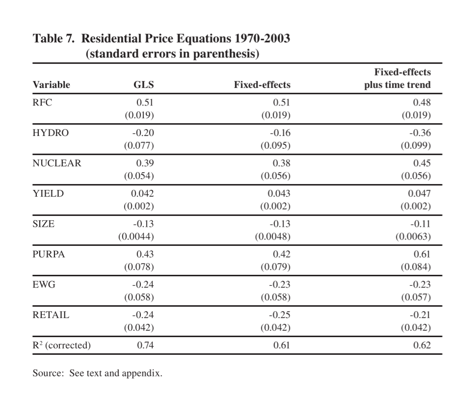
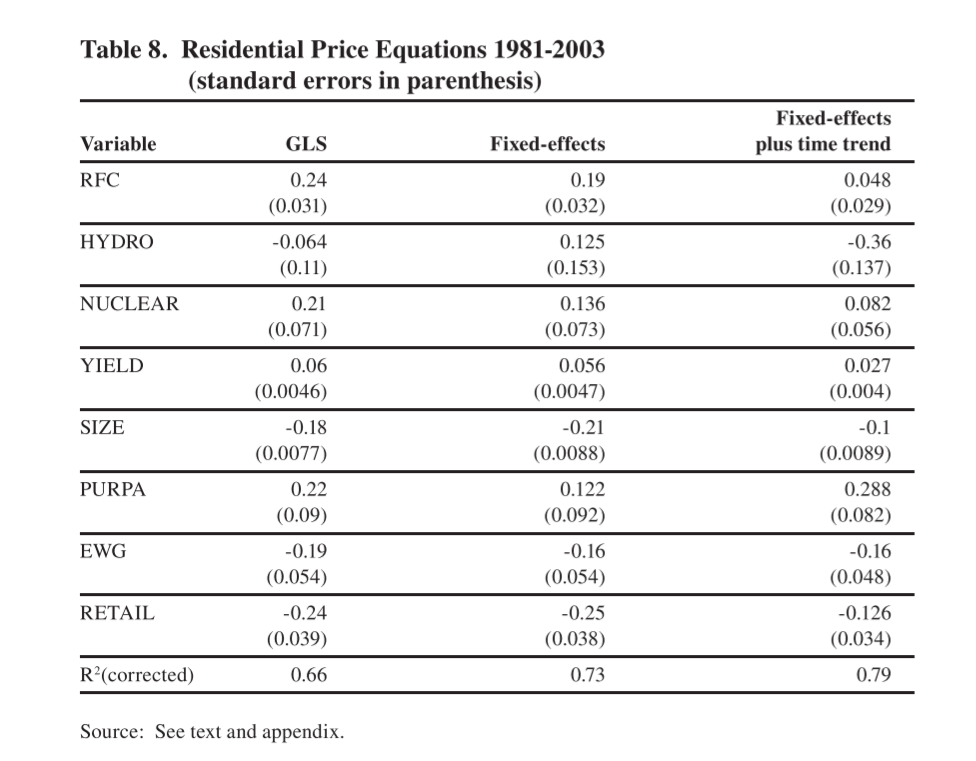
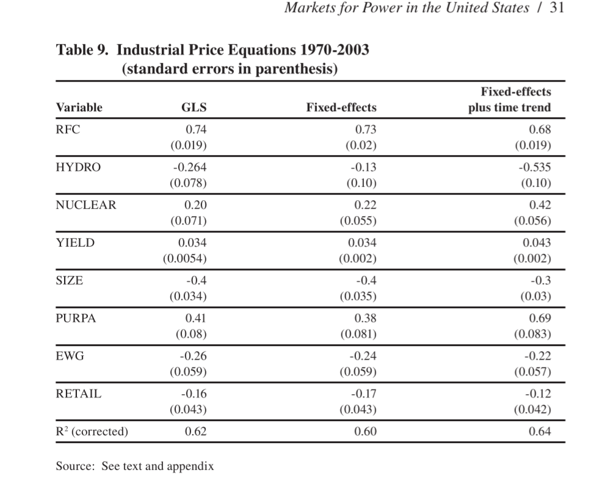
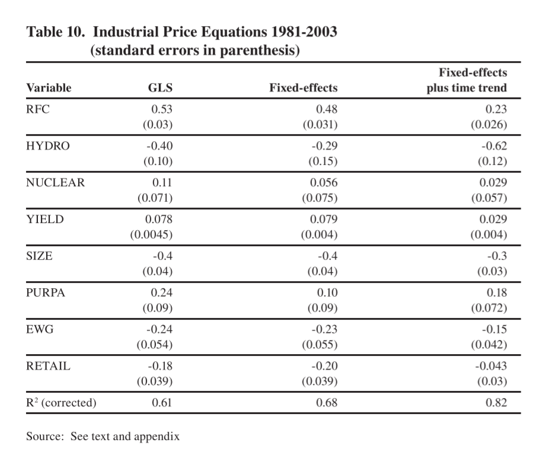

```{r setup, include=FALSE}
knitr::opts_chunk$set(echo = FALSE)
```

# Introduction

+ Mentions FERC 888, 889, 2000
+ The glow that faded from higher MC prices vs AC prices.
+ "Fragments of Evidence"?
    + Econ on big on making sure we describe causal effects, not just correlations.
    + We required control, or quasi-control groups for counterfactuals.
    
# Counterfactual

+ What would have happened in the absence of a treatment.
+ Example:
    + Randomized Control Trial (RCT)
    + Quasi-experimental controls
+ Hard to do with 50 states
    + Need stats that are very similar, one that chose deregulation and one that did not.
    + Those don't exist.
    + Or, a very good model (perfect) of why states chose to do what they do.
    
# Standard Market Design

NOPR in 2002 but withdrawn in 2005.  Many good ideas.

Check the reasons for the withdrawal in item 5.

https://www.ferc.gov/CalendarFiles/20050719123006-RM01-12-000.pdf


# Discussion of ISO-NE and NYISO

+ This is a nice discussion of how the parts work together.

# Wholesale Market

+ Common to look at difference in Locational marginal price (LMP)
+ He looks at average LMP and compares but
+ Notes that big variations within regions.
+ LMP differences indicates transmission is constrained.
    + Constraints can give market power to large buyers or sellers.
    + LMP differences indicate that there could be market power
    
# The Snake (Fig 2)

+ The diagram shows divergence in prices for part of the year.
+ Not whole year but there are still quasi-rents because of congestion.
+ You frequently check not  just average differences but also how the correlations between prices.
    + High correlation means the markets are well integrated.
    + Low correlation is evidence that the markets are not integrated.


# The Snake


    

# Retail Competition

+ There is a regression
+ Retail competition means that you buy electricity from someone else but still pay your LDC for distribution and ISO/RTO, through the LDC, for transmission .
+ Default prices, through the LDC, still include the capital cost of stranded assets.
+ BTW We tend not to switch from defaults.

# Notes on the Regression   

+ The author is right up front that this is not a good model.
    + Think of it as descriptive and not causal.
+ P is average over a state.
+ SIZE is never defined.
+ GLS means they take into account autocorrelation
+ Fixed-effects means they control for the state but equation one looks like random effects.
+ Fixed plus time trend  takes into account common year to year differences. Also looks like random effects.

# Specification



# Variables



# Residential 



# Residential



# Industrial



# Industrial



