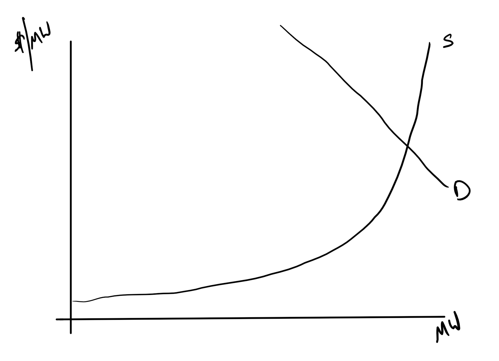
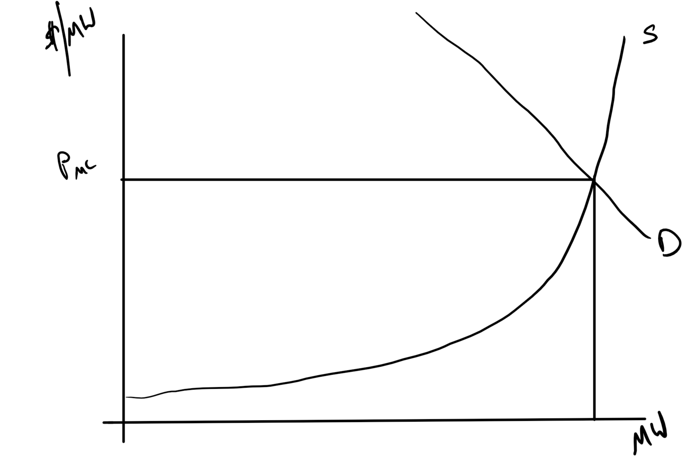
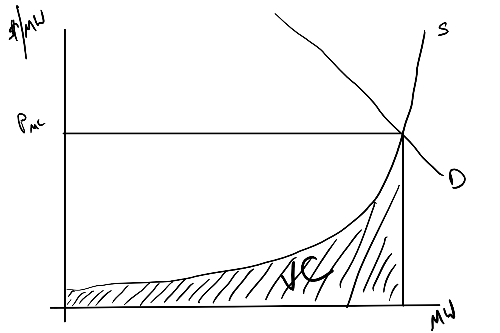
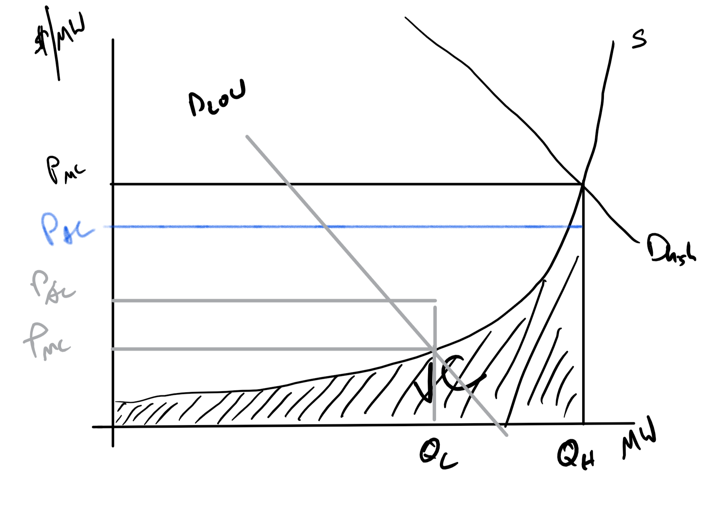

```{r setup, include=FALSE}
knitr::opts_chunk$set(echo = FALSE)
```

# Motivation

+ There is an interplay of prices based on average cost and prices based on marginal cost.
    + In traditionally regulated markets -- AC
    + In more deregulated markets -- MC
+ People favor the one that gives them the lowest price for the service they consume or the highest price for the service they provide.
    + This changes over time.
+ Distributed Generation is the new player in the MC/AC dance.

This is a quasi-rent argument.

# Rent?

+ *Economic rent* is any payment to a factor of production in excess of the cost needed to bring that factor into production.
+ *Quasi-Rents* are temporary

# Cost Drivers from 1990 till now

Most of the changes in costs were not regulatory but cost driven
+ Improvements in aircraft engine technology that made natural gas turbines  more efficient.
+ Semi-conductor innovations that made PV cheaper.
+ Labor saving techniques like Supervisory control and data acquisition (SCADA) systems

# Deregulation in Short

+ Make *Generators* (G) compete with each other
    + They are not natural monopolists unless
    + Transmission is very constrained
+ *Transmission* (T) managed by a disinterested party
    + They don't own it but develop markets for access
    + Create markets for reliability needs
    + Create markets for the generators to compete in
    + Watch those markets
+ *Distribution* (D) still ROR regulated
    + These are the local poles, which is a natural monopoly.
+ But there still can be retail competition.

# Patterns

+ Traditional vertically integrated -- One firm owns G, T, and D.
+ Most common deregulated pattern:
    + Some merchant generation (G), Independent Power Producers (IPP)
    + IPP participate in ISO/RTO power markets and sell to utility and others
    + Pay different prices for transmission (T) based on where power goes.
    + Most generation is still 'utility' owned.
    + Many people buy power from the 'utility'
    
# Why Transmission and Retail Access was key

+ If open access did not exist, the transmission owner could hold up a new generator and take quasi-rents.
+ If no access to retail markets (end-user) then they can only sell to the utility. More quasi-rents.
+ Even with many IPP there would still be monopsony power for the utility. More  quasi-rents.

# ISO/RTO

+ Don't own the transmission lines.
+ Don't own generation and can't show preference.
+ Control access
+ Often control production and access schedules.
+ Real-time (im)balance markets
+ Hyper-focused on reliability, which is the big commitment to The North American Electric Reliability Corporation (NERC).

Many places, PNW and The South, did not go for this and kept more traditional vertical integration but with open access.

# Generation

+ Some divestiture of generation assets by more traditional vertically integrated utilities.
+ Changes how generators are compensated.
+ With Vertically integrated
    + They had to be cited and  OKed by a PUC.
    + Compensated with a guaranteed ROR, Average Cost Prices.
 + Now they face a market and  Marginal Cost prices   
 
# Economic Dispatch Curve


# What To  See

+ Renewable and Nuclear is cheapest in MC sense because almost all  costs are sunk, capital costs. 
    + Hydro
    + Solar PV, Wind
+ Then comes a coal and  CCNG
    + Which comes first depends on relative fuel prices.
+ Then conventional  NG and peaker plants (petroleum in the diagram)    


# Idealize it



# Marginal Cost pricing



# Average Cost Pricing
Pay for Variable cost then add in Fixed Cost



# Compare the two



# What to See

+ Which price is higher or lower depends on:
    + Demand
    + The relative proportion of high fixed cost generation, solar, wind, nuclear.
    
+ Have not added Distributed Generation
    + Consumer side, behind the meter, generation.
    + Allows you to choose utility, average cost, power, or
    + Self generated, marginal cost, power
    
# Who Made the Transition


# Why

+ PNW has Federal hydro (BPA)
+ The South had powerful local utilities and Federal hydro (TVA)
+ PNW and The South also had some of the lowest retail rates at the start of deregulation in 1997.

# The 1990s

+ Lots of excess capacity.  Remember the A-J effect?
    + Lots of fixed costs to include in the price.
    + Everyone (Mostly large industrial consumers) could see the low marginal cost generators sitting there and wanted prices based on that.
+ Natural Gas prices were low, so influx of CCNG generation.

# Side Effects

+ Much of generation was uneconomic with MC pricing, but required by the state PUCs.
+ Utility stocks fell because these assets were no longer valuable.
+ They called them "stranded assets".
    + Not just plants
    + Also long-term contracts with IPPs.
+ Almost all the deregulation plans included paying the utilities for the stranded assets.

# California Approach

+ Freeze retail rates at the high rates for a while to allow utilities to pay for the stranded assets.
+ Consumers were stuck with high prices anyway.
+ Then BAM, 2000-2001, costs changed and it was not enough.

# What about Retail?

+ Lots of hope.
    + Look at what happened with deregulated telecom.
    + Mericans love their freedom.
+ But, what do you innovate? Electricity is virtually the most uniform product you can think of.
+ The default is to go with the old utility. (Status Quo bias).
+ Some regional variation but nothing happened.
    + Texas
    + North East are exceptions.
    
# Why No Innovation?

+ Old School volumetric meters.
+ Alternative pricing is often hard to swallow.
    + Common practice: *low* fixed charge per month with high kWh charge that includes all G and some T, D.
    + _Efficient_ Alternative: High fixed charge (Covering D and some T) and low kWh charge covering just T and G.

Low income households would see bills roughly double in that system.

# The Meters

+ Yes, smart meters would help retail.
+ But it has to be everyone.
    + (D)istribution still charges with average assumed load shapes not actual use.
+ Mostly you get Time of Use Pricing (TOU) not Real Time
    + Three or more prices that depend on time of day or day of week.
    + Example from PG&E (https://www.pge.com/en_US/business/rate-plans/rate-plans/time-of-use/time-of-use.page)
+ Could do service interruptions but hard to interrupt one house.  


# Performance

+ California
    + Crazy high prices
    + Capacity constrained
    + Forward contracts were not allowed
+ Everywhere else
    + Driven by either hydro, drought or non-drought.
    + Natural Gas prices (Often the marginal producer)
+ The stranded assets made a comeback
    + Coal and Nuclear were economic when natural gas prices were high.
    
# Productivity Gains

+ More in restructured areas.
+ Tended  to start with high prices that either fell or grew at slower rate.
+ Most gains were labor rated.
    + Supervisory control and data acquisition (SCADA) helped.
+ Most 1997 Uneconomic Nuclear plants
    + Now  IPPs
    + Now higher capacity factors than those not sold.
    
# Summary

+ Utilities sold generation assets in 1997 at low prices.
+ Same assets are worth more today.
+ More exposure to Natural gas prices hurt those that wanted MC pricing most.
+ More variable renewable (Solar and Wind) will make MC real-time prices more variable.

# About those rooftop PV systems
    