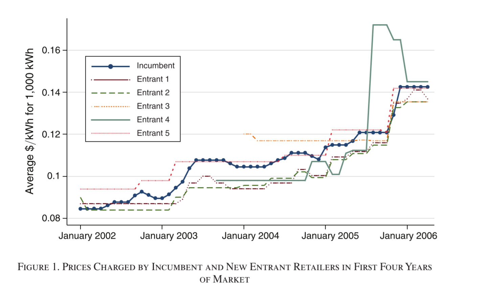
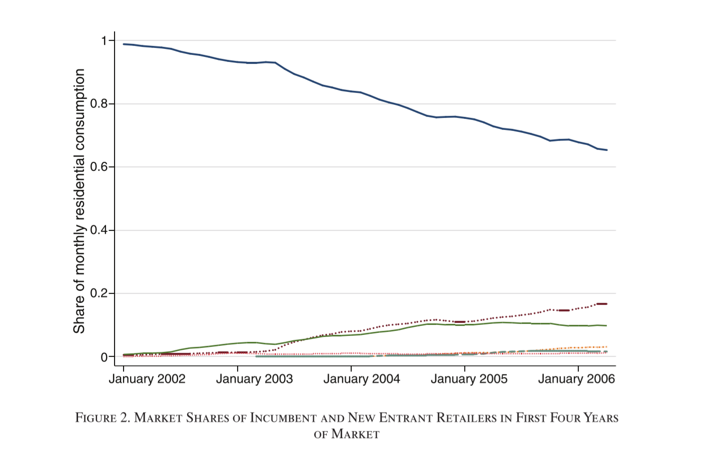
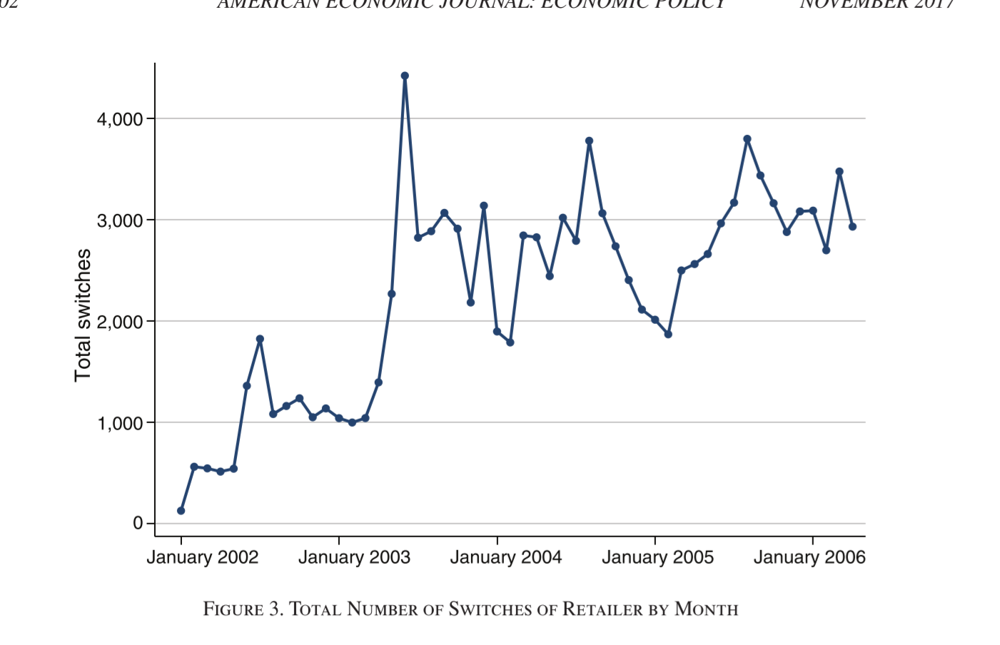
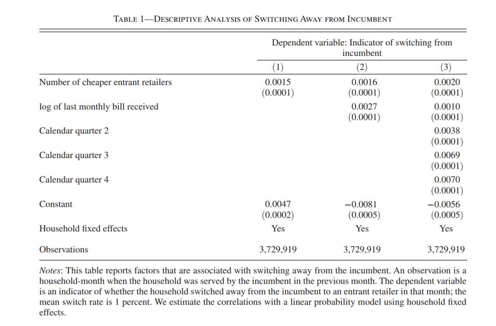
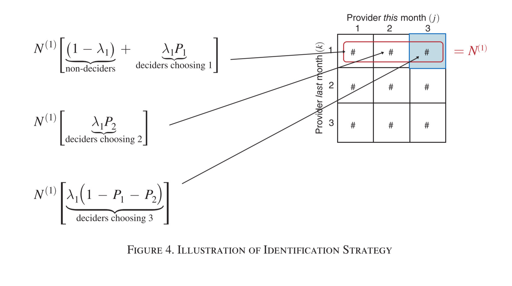
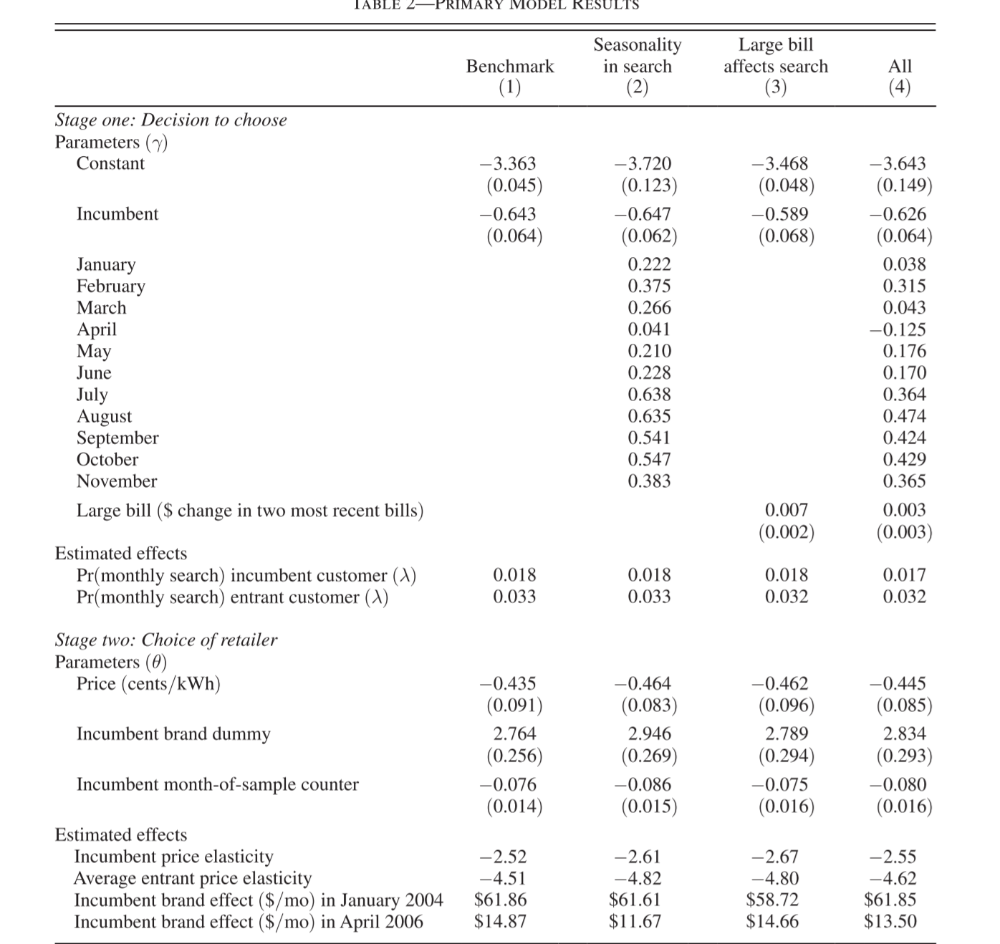
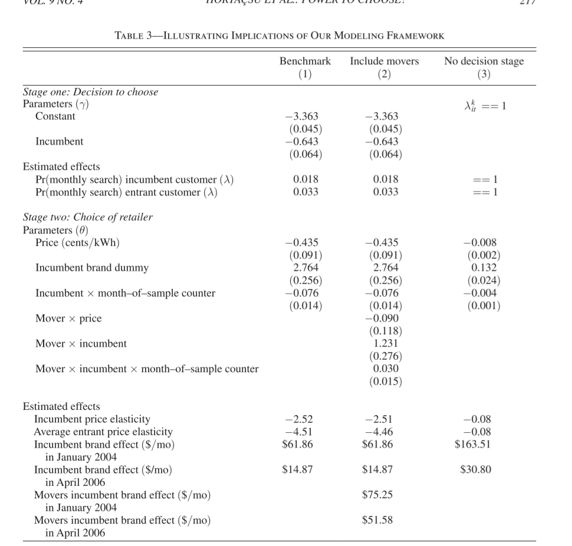
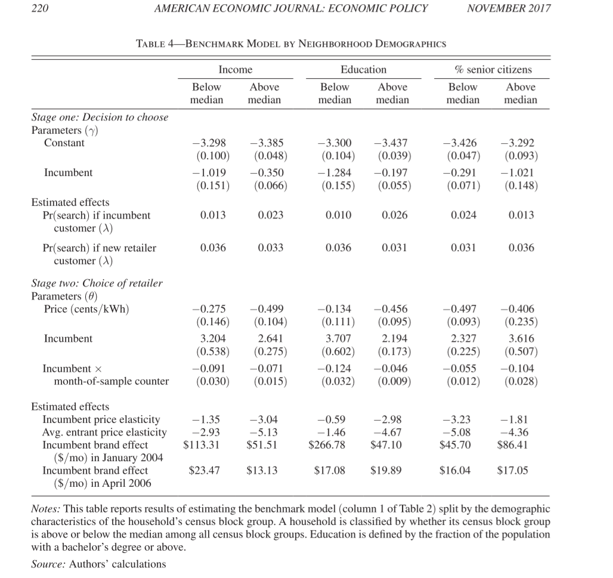
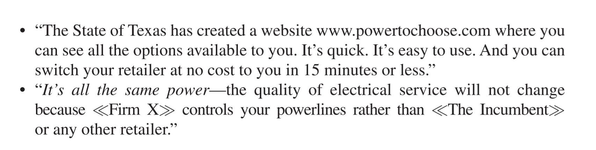

```{r setup, include=FALSE}
knitr::opts_chunk$set(echo = FALSE)
```

# Summary 

Based on Ali Hortaçsu, Seyed Ali Madanizadeh, and Steven L. Puller (2017) "Power to Choose? An Analysis of Consumer Inertia in the Residential Electricity Market"

+ Important because argument for efficient merchant generation requires retail access.
+ Inertial in choice, not changing vendors when you should, can hamper this.  This looks like brand loyalty.
+ Inattention, not looking for alternatives, can also mean that a low cost vendor can't get customers.

# The Setting

+ Texas has more retail competition, power but not distribution and transmission from alternative providers,  than any state, rivaled only by the New England states.
+ They set up a website that made it easy to  search.
    + They can observe who switched. (Micro data)
    + They can see people switching multiple times.
+ Model in two steps
    + Do you change? (Logit)
    + Who do you change to? (Multinomial Logit)
    + More common to just do one step, who do you choose, but this is better.
    
# The common approach 

+ The usual approach to this kind of choice problem is multinomial logit.
+ Multinomial logit builds a choice model by
    + Creating a latent variable, thing how much you like something, based on characteristics of the good.
    + Determine the odds of each choice based the relative merit of each.
    
# Odd example

This is not exactly right but gives the flavor

+ Three choices with how much you like them:
    + A: 10
    + B: 7
    + C: 3
+ You would choose 
    + A 10/20 = `r 100* 10/20`%
    + B 7/20 = `r 100* 7/20`%
    + C 3/20 = `r 100* 3/20`%
    
You never know for sure what people will choose but you can tell the probabilities (Technical: we see odds)

There is a technical assumption, independence of irrelevant alternatives 

# IIA Example

It means that if you add a new choice that is, from the decision makers point of view, just like one another, it should not change the odds of the remaining choices.

+ Three choices with how much you like them:
    + A: 10
    + B: 7
    + Blue C: 3
    + Red C: 3
+ You would choose 
    + A 10/23 = `r round(100* 10/23,2)`% was `r 100* 10/20`% 
    + B 7/23 = `r round(100* 7/23,2)`% was `r 100* 7/20`%
    + Blue C 3/23 = `r 100* 3/23`%
    + Red C 3/23 = `r 100* 3/23`%
+ Red C and Blue C should be together `r 100* 3/20`%

See the problem?  Keep this in mind.

# Logit

Logit is used for yes/no or true false and does the same thing.

+ Parameters give the change in odds
+ Note this paper uses a linear probability model to show some results.

# Sample Prices



# Price Comments

+ Incumbent, LDC, prices were rigged to be a little high because they are  still recovering capital costs.
+ Most of the time alternative prices are higher.
+ No idea if some of these are 'green'  That may be why sometimes these are higher.
+ TX has a bunch of wind and solar.

# Market Shares



# Comments on Market Shares

+ Wish I could connect prices to shares graphically.
+ Wish I knew marketing expenditures.
+ Makes sense that the incumbent shrinks
+ Notice that one rival takes off.
+ Notice that most new rivals enter and then hit a plateau
+ Notice that change  starts in 2003

# Switching -



# Comments on Switches

+ Should notice a pre-2003 vs post-2003 pattern.
+ See the spike in 2003?  
+ Authors made the smart choice  of not using the data before the spike.
+ Can't be sure that the world was the same before the spike and can't be sure that just a dummy variable would fix  it.

# Basics of Switching



# Comments on Switching

+ This is an LP model, which you tend to avoid when probabilities are not near 50%, but this is descriptive.
+ 3.7M observations so everything will be significant.
+ Look at the constant. Probability of switching  in any month is less than 1%
    + In model 3 the constant is quarter 1.
+ Not sure how I feel about number of cheaper entrants.  
    + Wouldn't I only need one?
    + What if too many choices paralyzed me. BTW well known behavioral econ effect.

# What is a Markov Model?

Probability of switching from one 'state' to another.  Example sick vs not sick.

+ Given sick:
    + P staying sick .2
    + P healthy .8
+ Given healthy
    + P stay healthy .95
    + P sick .05

# Often shown as matrix

Row is current state and column is the next potential.

|         | Sick | Healthy |
|---------|------|---------|
| Sick    | .2   | .8      |
| Healthy | .05  | .95     |

Note that the paper goes other way.  You can use them to find long-run probabilities


# Paper's Markov Model



# Comments on Paper's Markov Model

+ Every change is given you went to the website, did you stay or switch to others.
+ If you didn't visit, you didn't change.
+ Note probability of visiting the website is different depending on your ESP.
+ This is the second stage.


# Main Results



# Comments on the Main Results

+ See no SD for months.  Common  for nuisance parameters.
+ Large bill is probability correlated with month, why the effect goes down and is not significant in model 4.
+ Incumbent (LDC) parameter is stable.
+ Once you start switching, you are more  likely to switch again.
+ Brand effect gets smaller
    + Slightly larger potential savings later.
    + Unbelievably huge earlier
+ See different price elasticities.

# People that Move are different?



# Comments on the movers.

Basically, people that moved had less information and focused on the LDC 

# Robustness Check



# Comments on Robustness

+ This adds new variables, could be robustness or just different ways of adding the variables.
    + The divisions are neighborhood effects.
    + They can't observe who you are.
+ Rich, Educated and not seniors have smaller brand effects.
    + Differences compress over time.
    + Poor and elderly can be very risk averse.

# Two Potential Treatments

Thought experiment on why there is a brand effect.  These are two potential bill stuffers.



# The stuffers.

+ Low cost to switch.
+ Same produce, only the price is different.


# A Few Small Flaws

+ No real analysis for risk attitudes. Low income and elderly face more risks to change.
+ Why has no expert middleman arisen to handle switching?  
+ IAA? What if the alternatives had the same price or prices that were 'similar enough'?