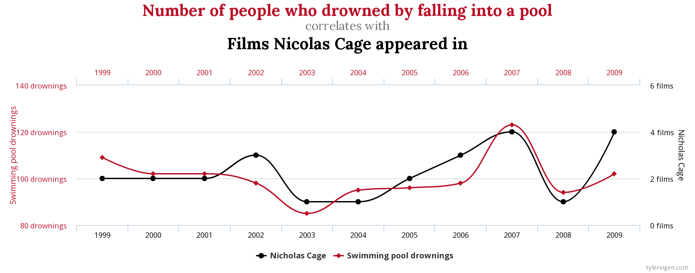

```{r setup, include=FALSE}
knitr::opts_chunk$set(echo = FALSE)
```


## The Goal

Most of the papers you read are looking for evidence that something caused something else.

+ Some of this evidence is from hypothesis tests.
+ Some is through how the data is collected


## Cause

+ What we usually want to know is what is the effect of changing one variable on another variable.

+ We want cause, not just correlation (https://www.tylervigen.com/spurious-correlations)

## Please Stop Nicolas Cage



## Ideal

Run an experiment (Randomized Control Trial or RTC):

+ Get a well mixed relativly homogenous group.
+ Randomly subdivide in to two or more groups.
+ One group is the control
+ Treat the others.
+ Observe response.
+ Difference response between control and each group is the average response, which has a mean and variance and you can do stats with.


## Easy Right

What if the groups are not quite the same, the technical term is unbalanced, which is just one definition of the unbalanced?

+ One group has more old people or poor people.
+ You need to make sure you take into account these differences.
+ Because treating things that are different as if they are the same is bad.
+ Simpson's Paradox

## Example 

Votes in the U.S. House of Representatives in favor of passing the Civil Rights Act of 1964:

\begin{table}[h!]
  \begin{tabular}{rr}
  Democrat & Republican\\ 
  61\% & 80\% \\ 
  \end{tabular}
\end{table}

On average, Republicans tended to vote for passage more than Democrats

## But there is another factor

\begin{table}[h!]
  \begin{tabular}{rrr}
  & Democrat & Republican\\ 
 North & 94\% (145/154) & 85\% (138/162) \\ 
South & 7\% (7/94) & 0\% (0/10) \\ 
Overall & 61\% (152/248) & 80\% (138/172) \\ 
  \end{tabular}
\end{table}

In *both* North and South, Democrats are more likely to vote for passage than Republicans.  We treated Northerners and Southerners the same in the first chart -- Here they are shown to be different.

## How Easy is That?

+ You know how to do Chi-squared test?
+ Just gather factors and ...
    + Eye color (8)
    + Hair color (8)
    + D2/D4 (2)
    + 128 cells so far.
    
You just found the curse of dimensionality.  You need to combine or ignore some of these because you will not have enough observations.

## Continuous Variables

Height:

+ Less than or equal to 5'5", greater than 5'5"
+ But 5'5" and 4' 11" are in the same category and 5'4" and 5' 6" are not?
    
Need a way of matching with continuous variables.  Regression allows you to do this.    


## Just Basics

Doing Econometrics well is hard.

+ EC 460 will teach you the basics of single-equation regression, e.g., demand estimation, and how to fix some things.
+ Make you overconfident.
+ Functional work requires:
    + Systems equation estimation, e.g., supply and demand at the same time.
    + Discrete choice, e.g., Yes/No or make and model of a car. 
    + Knowledge of how to get causality, experimental, e.g., RCT, and quasi-experimental methods, e.g., regression discontinuity.
    
## BASICS Single Equation

Explain something, often called the left-hand side or endogenous variable, with explanatory, right-hand side or exogenous variables.

$$Weight = \alpha + \beta Height + \epsilon$$

+ Weight is left-hand side
+ $\alpha$ intercept term, expected weight given you have no height. 
+ $\beta$ How much your weight increases for every inch of height.
+ $\epsilon$ How far off we were.
+ All the greek letters are random variables.  We estimate the means and variances of those.

Generating Fake Data with Weight = 20 + 2.75 Height + n(0,40)

## Fake Data

```{r echo=FALSE, message=FALSE, warning=FALSE}


HWFake<- data.frame(Height = rnorm(mean = (12*5)+10, sd = 10, n= 100))
                    
HWFake$Weight <- 20 + rnorm(mean = 20, sd = 40, n = 100) + 2.75*HWFake$Height

library(ggplot2)
library(dplyr)

HWFake %>%
  ggplot(aes(x = Height, y = Weight)) +
  geom_point() 
  
```


## Regression Output

```{r echo=FALSE, message=FALSE, warning=FALSE , results = "asis"}
library(stargazer)


FakeRegression <- lm(Weight ~ Height, HWFake)

stargazer(FakeRegression, header = FALSE )

```


## The parameters

The Parameter Estimates:

+ Estimates of the line through the data $Weight = `r coef(FakeRegression)[[1]]` + `r coef(FakeRegression)[[2]]` Height$ 
+ The True values are: $Weight = 20 + 2.75 Height + n(0,40)$

Note that the values are not the same.  Each of the estimated values comes with uncertainty.  It is a random variable.  Those are the numbers in parentheses are standard deviations of the estimate.


## With Confidence Intervals

```{r echo=FALSE, message=FALSE, warning=FALSE , results = "asis"}
stargazer(FakeRegression, header = FALSE, ci = TRUE )
```


## Of Note

+ 95% confidence intervals are about +/- 2 standard deviations
+ There is a 95% that the true value is in that interval
+ Asterix indicate that the probability of seeing this value by chance alone is small.  Commonly called significance.

## The Lower Part of the Table

```{r echo=FALSE, message=FALSE, warning=FALSE , results = "asis"}
library(stargazer)


FakeRegression <- lm(Weight ~ Height, HWFake)

stargazer(FakeRegression, header = FALSE )

```


## Overall

Regression as a whole:

+ $R^2$ fraction of variation in LHS explained by variation in RHS.
    + Because if you add more variables $R^2$ goes up, Adjusted $R^2$, penalizes for having more variables.
+ Residual Std. Error is the standard deviation of the error term.  We generated the data with N(0, 40)    
+ $F$ Difference between model that is mean of LHS alone, just the intercept, vs model with RHS.  IOW, things other than the constant explain things.


## Complications

+ Dummy Variables, which indicate categories like eye color
+ Transformations like log and powers

## Categories

+ They usually leave one out, often the control or most common category.
+ These get accumulated in the constant term
    + The constant could be Blue eyes, Short, non-economist
    + Additional coefficients would indicate the difference between brown eyes and blue.  Another would be tall vs short.
+ Always figure out who the constant represents.

The reason is a math thing about minimization or maximization.

## Transformations

+ Usually these are because reality works this way, the amount of light from a source decreases by the square of the distance.
+ Sometimes it solves a problem with residuals (heterskedasticity)
+ Often come with interpretation
  + $Y=\alpha + \beta x$
  + $ln(Y)=\alpha + \beta x$: A 1% increase in x increases y by $\beta \%$.
  + $ln(Y)=\alpha + \beta ln(x)$: $\beta$ is an elasticity.  1% increase in x increases y by $\beta \%$.
  
  
## When Reading a Table

+ Never just go, this is significant and this isn't.  Understand how it fits in the story.
+ Some of the variables are "just controls" and others are the key variables.
+ Tell the story of the key variables.


## Problems

+ LHS is a dummy variable, e.g., buy or don't buy, then we use a probit or logit.
+ One of the RHS variables is endogenous, like how renting or buying is determined by income credit and cost of living in the area.  We use instrumental variables for this.

## How We Use Regression for Causality

+ In real randomized experiments like RTC, to balance taking into account that the randomly generated groups could have slightly different characteristics that are important.
+ With Quasi-Controls
  + Matching like caliper or coarsened exact matching.
  + With outside pseudo-randomizer like regression discontinuity test.
  + Difference-in-Difference, match pre-treatment movements and parameters with a control group and then look for differences post intervention
  
## Coarsened Exact Matching (CEM)

+ Break RHS variables into histograms.
+ Multivariate histograms
+ Remove observations that do not have a treatment and a control observation.
+ Remove influence of observations not in joint support.
+ Balance the cells for treated and not treated.

## Hypothetical Data

```{r echo=FALSE, message=FALSE, warning=FALSE, paged.print=FALSE}

#Construct Fake Data

library(cem)

x <- rnorm( 300, mean = 2, sd = 2)
y <- rnorm( 300, mean = 2, sd = 2)
Group <- "Treatment"

xc <- rnorm( 300, mean = 6, sd = 2)
yc <- rnorm( 300, mean = 6, sd = 2)
Groupc <- "Control"

FakeCEM<-rbind(data.frame(x = x, y = y, Group = Group),
data.frame(x = xc, y = yc, Group = Groupc))

ForWeights <- cem(treatment = "Group", data = FakeCEM)

FakeCEM %>%
  ggplot(aes(x =x , y =y, group = Group)) +
  geom_point(aes(color = Group)) + 
  geom_vline(xintercept = ForWeights$breaks$x)+
  geom_hline(yintercept = ForWeights$breaks$y)
```

## With Unmatched Observations Removed

```{r}
library(cem)


data.frame(FakeCEM, Weights = ForWeights$w) %>%
  mutate(Removed =  (Weights == 0))%>%
  mutate(Group = ifelse(Weights !=0, as.character(Group), "Removed") )%>%
  ggplot(aes(x =x , y =y, group = Group)) +
  geom_point(aes(color = Group)) + 
  geom_vline(xintercept = ForWeights$breaks$x)+
  geom_hline(yintercept = ForWeights$breaks$y)
  

```
  

## Differences-in-Differences (DID)

Start with a treated group and go looking for an untreated controls group.

+ Test if there is parallel movement, basically all the parameters except the constant term are the same.
+ Check if the treated group reacts differently after the intervention.

## Example

Relationship between height and weight.  One group got free passes to the gym if they went a few times a month and the other did not

\begin{equation} 
\begin{split}
Weight = \alpha_{treated} + \alpha_{control} + \\ \beta_{treated, pre} Height  + \beta_{control, pre} Height + \\ \beta_{treated, post} Height + \beta_{control, post} Height
\end{split}
\end{equation}


+ Parallel movement test is $\beta_{treated, pre} = \beta_{control, pre}$ but not $\alpha_{treated} = \alpha_{control}$.
+ Average effect is $\beta_{treated, post}  - \beta_{control, post}$ 
+ Can be more complex than this if the treatment changes multiple terms -- including the intercepts.


## Lets Pull Some of Your Regessions


  