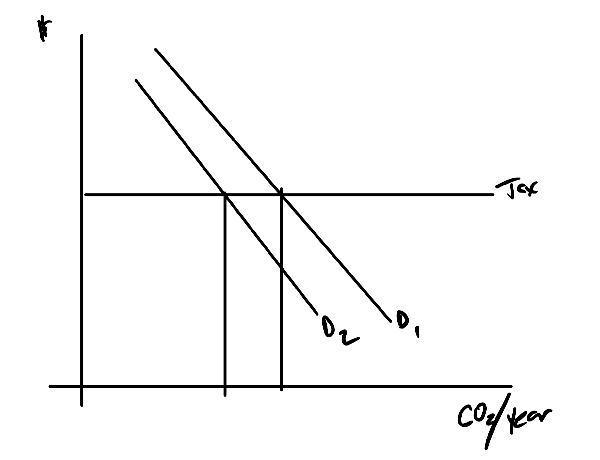
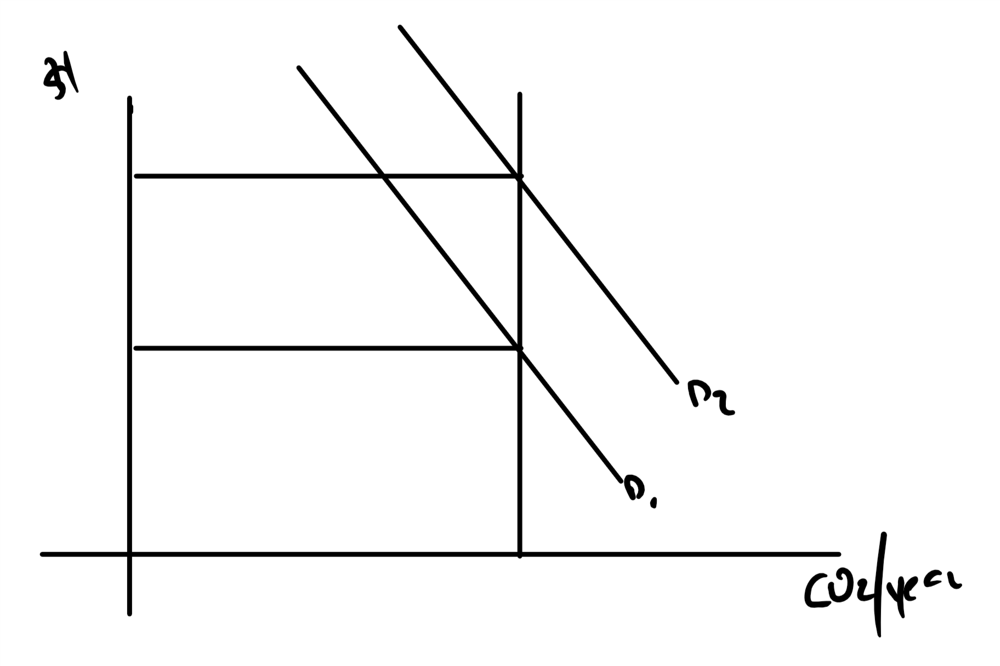
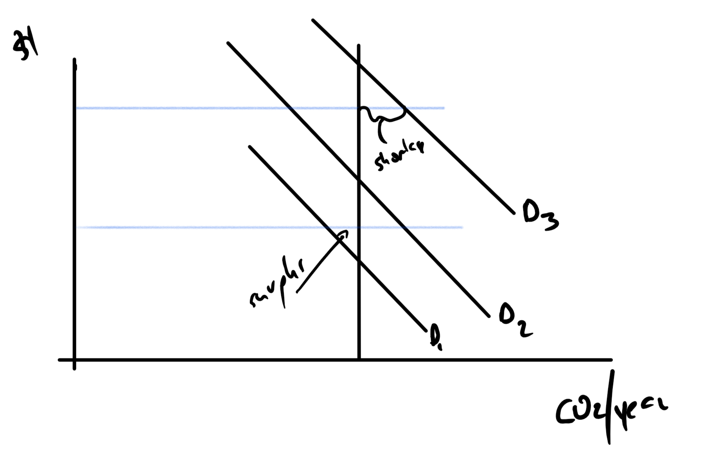
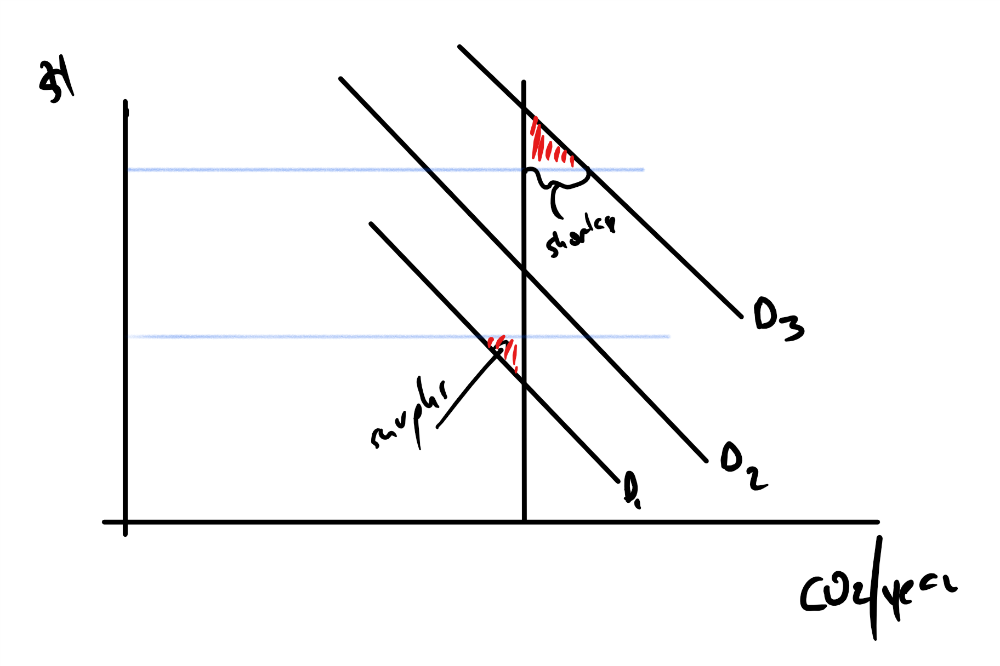

```{r setup, include=FALSE}
knitr::opts_chunk$set(echo = FALSE)
```


# Cap and Trade vs Tax vs Direct Regulation

The idea is to limit the amount of GHG emissions by getting a price on them.  This is a classic externality problem with a few classic solutions.

+ _Direct Regulation_: Limit how much from each site or tell people  how they must control GHG.  Renewable portfolio standards and fuel prohibitions fit in this category.
+ _Tax_: Charge per ton of $CO_2$ or $CO_{2e}$, the e is equivalent and gets at the other gasses that act in a similar way.
+ _Cap and Trade_: Allocate property rights, allocations, and allow people to trade.

# Direct Regulation

This is a very common approach.  It gets the reductions but does not do it at the lowest cost.

+ Some site find it easy and some find it hard to make reductions.
+ Example:
    + Site A costs 1$ ton to reduce GHG and Site B, $3 per ton.
    + If each reduce 1 ton, two total, the cost is $4.
    + If site A reduces two tons and site B  reduces not at all, the cost is $2.

# Carbon Tax and Cap and Trade

+ Tax, pick a price that is consistent with the desired emissions per year.
    + Tough to get the right price.
    + All natural variation and uncertainty creates variable emissions.
+ Capt and Trade, treat the right to produce GHG like any other property right.
    + Gives a known emissions level but natural variation results is variable prices.
    + Business hate it when costs are variable.
    + Right to produce is called an allocation.

# Carbon Tax



Demand fluctuations make GHG emissions fluctuate.

# Cap and Trade



Demand fluctuations make prices fluctuate.

# Room for Compromise

You can put and  ceiling and a floor on the price of allocations -- a collar.

+ Gives environmentalist certainty.
+ Produces less variability in price for business.

Like all market constraints, it complicates things.  What do you do when the price hits the floor  or ceiling.

# Bounding Price



# Shortage and Surplusses

+ At the ceiling, people want more allocations than exist.
+ At the floor, people want fewer allocations than are for sale.

You need a mechanism to allocate when you can't user price.

# Method 1

Just ignore it:

+ At the ceiling, some people will be able to buy allowances and others will not.
+ At the floor, some people will be able to sell and others will not.

The floor is rough if you counted on selling the allowances for revenue.  The ceiling it rough if you need an allowance and can't buy.

# Econ Picture DWL



# Market Maker Approach

Someone (Government) stands ready to buy and sell allocations at all times:

+ They buy when prices hit the floor
    + Hope you don't run  out of money before you get to sell.
+ They sell when the prices hit the ceiling.
    + Hope you bought enough when you were at the floor.

No guarantee of revenue neutrality.  History shows that these spend a lot of time at the floor value.

# Why so much time on the floor?

+ Plenty of direct regulation, e.g., RPS, coal bans, to reduce GHG emissions.
+ The annual limitations, supply, must make sense given the price floor.
+ The annual allocations have been far too large given the floors.

Allocation prices on the floor are not evidence that direct regulation is all we need, it indicates we picked the wrong floor/annual allocation  combination.

# Why being on the floor is bad

Besides allowances there are also "offsets"

Offsets are new reductions in GHG:

+ Geologic sequestration of existing.
+ Methane capture
+ Agricultural land management that reduces emissions.

If the price is low, you don't invest to make these reductions.

# Changes from Year-to-year

+ With a carbon tax, this would be a slow increase in the tax from year to year.
+ For cap and trade with a collar.
    + Annual reduction in allocations
    + Annual increase in both the ceiling and floor.

# Oregon Complications

We are trying to do cap and trade with a collar but there are complications:

+ OR constitution says gas taxes have to be spent on highways.
+ "Revenue bills" have to pass legislature with 3/5 majority
    + Recent court decision is redefining revenue bills.
    + There is still room for appeal.
    + Still room to punt -- "send it to the voters"
+ Reasonable resources for transition
    + Somehow raise money from the sale of allocations.
        + Consignment
        + Free allocations
        + Direct sale
    + An investment plan    
    
# Oregon Complications (Con't)    

+ "Leakage" firms leaving the because of a price on carbon
+ Complex rules that could make some people pay twice for GHG and other pay not at all.
+ Interaction between:
    + Public Utilities commission
    + Global Warming Commission
    + Environmental Quality Commission
    
# Current State of Affairs

+ There is a placeholder bill from the 2017 session SB 1070 "Cap and Invest" (https://olis.leg.state.or.us/liz/2017R1/Measures/Overview/SB1070)
+ They have been holding workgroups to explore the ideas and get feedback (https://www.oregonlegislature.gov/helm/Pages/clean-energy.aspx)
    + Meeting material and video online.
    + If you have the time watch the videos
        + "Steakholder" group with a few experts thrown in
        + Sen Beyer used to be on PUC and was the executive director.
        + Carl Fink is very good 
+ I will spend little time on how to spend the money.
    

# Major Questions

+ What goeslegislation and what is rule making?

# Wait...Rule making?

+ Legislatures pass bills that become law, statute for the most part
    + Oregon Revised Statutes (https://www.oregonlaws.org/oregon_revised_statutes)
    + United States Code (http://uscode.house.gov/)

+ Laws are always incomplete so you need clarification on what they mean, the clarification are called many things:
    + Code of Federal Regulations (CFRs) (http://www.ecfr.gov/)
    + Oregon Administrative Rules (OARs) (http://sos.oregon.gov/archives/Pages/oregon_administrative_rules.aspx)
    + Policies

# Rule Making Body and Implementation

+ Regulation are made by rule making bodies
    + Commissions and Boards: commission are told to do things by another higher group and formed by them.  Boards are at the top.
    + HECC was created by the legislature
    + Boards of Education were created on their own.
    
+ Implementation is by staff in an agency or other government body.

# Example New Oregon Law

+ New ORS
+ Agencies and commissions created by Oregon Law create new OARs
+ All governments under oregon law must obey the ORSs and OARs
    + They create detailed 'regulations' often called 'polices' if they need to.
    + The laws these other bodies make are also called 'polices'.

# Federal Example

+ New US Code
+ Agencies and commissions created by Federal Code create new CFRs
+ All governments under US code must obey, so legislatures may create new laws *or* 
    + Their agencies may create new regulations to clarify
    + The other downstream Boards may make policy independent of the level above.
    + Schools would write new policy for a CFR change even if OARs did not change.
    
# Administrative Procedures

+ Most states have them.  Oregon is https://www.oregonlegislature.gov/bills_laws/ors/ors183.html
+ The federal is in Title 5 section 500 of the US code.
    + It dates back to 1946 and sets up the adversarial system 
    + Also record keeping and some other procedures.
    
# How to make a regulation

+ Issue a Notice of Inquiry
+ Notice of proposed rule making (60 days for comment and 30 to reply)
+ Further notice of proposed rule making.

+ For Federal you can look here for the latest. https://www.regulations.gov/
+ With state you have to go agency-by-agency.

# Other places

+ Can be as simple as "noticing" the rule
+ Have several readings in an open meeting
+ Vote and pass.

+ Oregon generally requires two readings.

# Always a provision for review

+ At federal level, you can see a judge.
+ At state level you can do that too, often the commission is the first judge, then you may get an administrative law judge, then a "real" judge

+ The legislature may review the regulations

# Remember ...

*Every procedure can be manipulated to an advantage*

+ Regulation is not apolitical, there is just less press attention.
+ Boards and commissions tend to be appointed, not elected, and they are not so sensitive to political contributions.
+ Sometimes, the regulators, "Bring a knife to a gunfight"

# Involved Agency

# Point of Regulation

# Leakage -- A Bad Word

Means producers leaving

+ Need to have this change when others adopt cap and trade

+ Talking about NAICS codes to define.

+ Benchmarking

+ Allowance allocation

+ Risk diminishes with more online and should be removed.

+ JW we need to focus on the effect on relative energy prices.

+ What about trade patterns changing?


# Relationship to RPS and Coal Prohibition

+ Overlay
+ Credit


# Interaction with PUC

# Trade Exposured Emissions Intensive

+ Not just energy intensive

# Possible Definitions

# Possible Solutions

# Transition Considerations

# Consignment, Free Allocations, Direct Expenditures

# Banking Allocations

+ Degrade?
+ time limits?

# Related Reserves for High Costs

# What the Markets Look Like

+ WCI
+ Futures Market

# Market Power Considerations

+ Similarities with SO_2 markets
+ Use to maintain market power

# Offsets

CA limited this. 

8% total now 4% with 2% in state.

Little action because the price of allowances are not high.  On the floor.

# The Offset Markets and Clawback

# California's Offset Reduction

