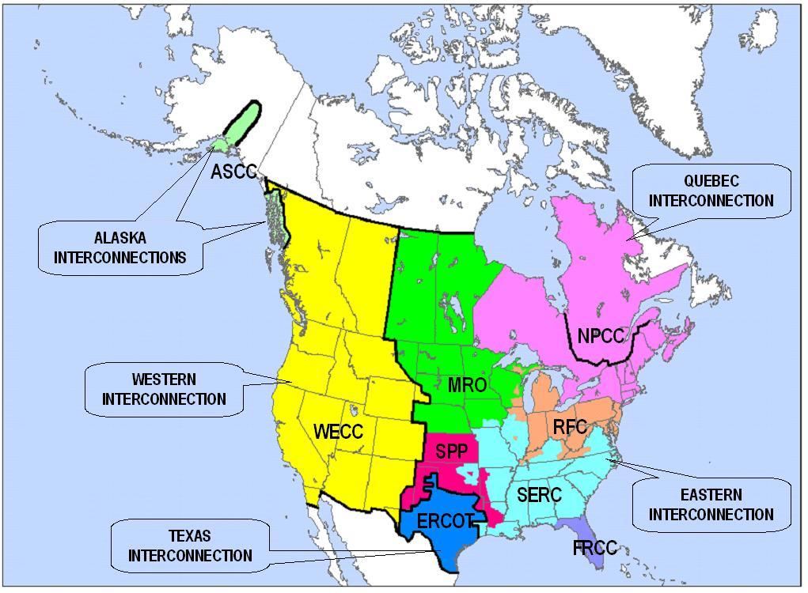
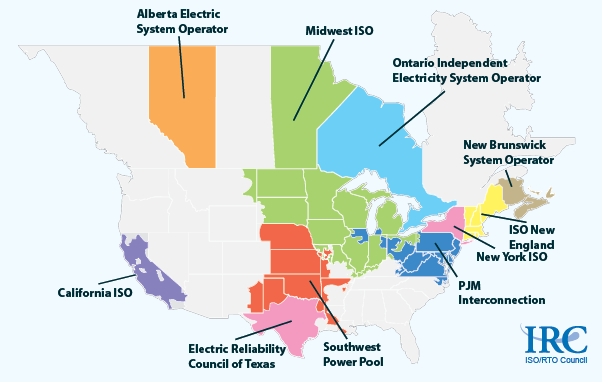

```{r setup, include=FALSE}
knitr::opts_chunk$set(echo = FALSE)
```

# Initial Comments    

+ We are a pretty traditional cost-of-service regulation area.
+ The PUC, the main regulator to worry about, needs authorization from legislature to do things like care about GHG and to treat low income people differently.


# The Big Divide

We usually break up electricity regulation into three parts (DGT):

+ Distribution -- the wires and poles near your house and the substations.  This is your core local electric company like PGE.
+ Generation --  ... so you spin a turbine.  May or may not be same company is distribution and there are markets.
+ Transmission -- the high voltage wires that get electricity from the Generation to the Distribution system. May or may not be the same but there are posted prices (OASIS)

The business units cross lines

# Invester Owned Utilities (IOUs)

+ Idaho Power, PacifiCorp, Portland General Electric.

+ There are also cooperatives and public utility districts (PUDs)

They are generally vertically integrated, owning D, G and T

# Vertically Integrated, but not totally

+ Just means the firm includes what could have been a supplier or customer.
+ Pluses and minuses with this
    + Could reduce transaction cost
    + Could also cause more monopoly power problems
    + Why we peel off part and turn into markets when we can.
    
The power that gets to your house could be:

+ From IOU owned G or contracted.
+ On your IOU T or contracted.
+ But it gets to you from the substation with IOU D

# Part of the Western Interconect



# The Interconnects

+ Everyone runs at 60 Hz
+ In phase within interconnects
+ but not in phase between
+ Transfer power through DC lines

# On the T side, balancing authorities

+ Make sure there is enough power RIGHT NOW for the people that are trying to use it RIGHT NOW.
+ BPA and the IOUs are all balancing authorities.
+ You can buy access if you want to privately contract for power to your location.
+ Reliability regulation by Federal Energy Regulatory Commission (FERC)

# Elsewhere there are ISOs and RTOs

+ Non-profit
+ Plan for necessary transmission
+ Run transmission markets
+ Run markets for ancilary services
+ Run markets for power like the Energy Imbalance Market (EIM)

# Map



# The G

+ Mix of IOU owned generation
+ Market based merchant generators
+ PURA facilities: If you don't have an ISO then you have to purchase from qualifying facilities at PUC created prices that represent avoided costs, what the IOUs would have spent.

# The Public Utility Commission (PUC)

+ Represent the ratepayers which we do through the Citizen's Utility Board (CUB)
+ Rates, valuation of assets, services and ...
+ Everything the legislature tells them to do.
+ Nothing the legislature has not given them authority to do
    + No special treatment for low income
    + No GHG in general, but specific instances

# Key Component of Regulation

+ "Revenue requirement" (RR) which is all expenses, income statement items, plus a fair rate of return on the capital, balance sheet items.

+ This is a constraint.  It does not fully determine rates or anything.

# If costs grow beyond authorized or want to build

+ Open a rate case
+ Propose new rates based on a test year and forecasted loads, expenses, capital additions
+ Most people can't pick new supplier so PUC must simulate the result of competitive pressure.

# Then

+ PUC verifies, often reducing, the revenue requirement
+ Takes about 9 months

# Peeling off Functions

+ Energy Efficiency
    + Good for society but
    + How do you get a firm to reduce sales when they make money from sales.
    + Fancy term Decoupling, 1992, with creation of the Energy Trust in 1999.
    
The Energy Trust is a non-profit utility under the PUC that provides energy efficiency.


# How you get to RR?

Integrated Resource Planning

+ Forecast load for 20 years
+ Project out everything you need to do that
+ Price it
+ Is part of making sure all expenditures are prudent.

# Another Peel off, Power costs

+ We allow year-to-year changes to rates to account for this.
+ If there is savings, they are shared with ratepayers
+ If they underestimated, they are recovered from ratepayers

This is often power purchases from merchant generators.

# History Begins 

Which starts with SB 1149 (1999), our version of deregulation required by FERC.  We did not get an ISO but:

+ Large commercial and industrial consumers can buy from other providers.
+ Public purpose charge for EE, renewables, low-income weatherization.
+ More rate options with renewables
+ Low income assistance fund.

# SB 838 (2007)

+ Renewable Portfolio Standard (RPS)
    + Can pass along ALL costs to ratepayers
    + Cost cap, only 4% increase
+ Acquire all Cost-Effective EE

# SB 1547 (2016)

+ Increase in RPS and remove some ability to bank their previous renewable efforts.
+ Remove all coal generation by 2030.
+ Create community solar.
    + So, residential can choose a supplier too.
    + BTW, they just sorted this out a few months ago.
    
# Other Tools

+ Bidding rules for capital RFPs.
+ 2009 GHG standards, which basically killed new coal plants or any long-term contracts
+ 2015 Energy Storage mandate but only 1% of peak load

# Where are they going next?

SB 978 (2017) process, "explore changes to the existing regulatory system and incentive that could accommodate developing industry trends and support new policy objectives without compromising affordable rates, safety and reliable service." for changes "in the interest of customers and public generally."  

# Political Process

+ Trying to build coalitions supporting actions.
+ Try to get groups into that coalition
+ Facilitation by Rocky Mountain Institute
    + they like it green
    + they like free markets
    + Real expertise so newbies don't get pushed around

  
# Big Future/Current Issues

+ Caring about $CO_{2e}$, but they need legislative authorization
+ Low-income and equity, but they need legislative ...
+ Transportation electrification, but they need ..
+ Distribution networks, distributed generation and information, but ..
+ Interacting with the CAISO.

# Caring about $CO_{2e}$

+ They can only look at this as a risk factor in forecasts
+ Participants: Move quickly
    + Maximize EE for both electricity and natural gas
    + Transition to renewable
    + Decarbonize transportation
    
...but they need legislative authority.

# Low-income and equity

+ Innovative programs elsewhere:
    + Pay percent of income programs
    + Lower prices for low income
+ ETO can't treat low income differently
    + Other states treat 1 kWh saving by low income as more than 1 kWh
+ Making participation in PUC easier for groups and participants

# The Participation thing

+ They used to just accept testimony
+ Now they actually go to groups in effected areas and ask questions.

# Includes Environmental Justice

+ Making sure certificates of public convenience, needed for transmission, is not too focused on low-income areas.
+ They can't treat them differently, not authorized.
+ They do go to those areas for more comment.


# Distribution networks, distributed generation and information

+ Underinvestment for decades
    + They don't even have all the phasors (measurement thing) that they need at substations.
    + Assumptions of no distributed generation, like rooftop PV.
    + Assumes power comes from them only.
    + No systems to adapt
+ Difficult to balance choice with other objectives
    + The system is built on socilizing all costs, but
    + When people withdraw, then burden is on those that stay.
    + Yes, the charge you to not be connected because of this

2025 to 2030 CA utility PG&E may only service half the load in territory.  They still have to collect system and transition charges to fund the existing infrastructure.     

# Transportation electrification

+ PUC can look at GHG reductions from electrification.
+ But can't include GHG in transportation rates.
+ SB 1547 approves some transportation electrification programs.

# Utility Incentive Alignment

Performance Based Regulation (PBR)

+ Allow discrete payments if specific objectives are achieved
+ Managing peak load growth rather than just building new G.
+ Less K to solve problems and more Expense.  Avoiding A-J incentives.

# Regional Markets

+ People love the Energy Imbalance Market.
+ PacifiCorp and PGE signed MOU saying they want in back in 2015
+ Problem: CAISO has a board appointed only by CA Governor. Oregon leg says solve or no go.

#

Fin.  Grab a beverage for social hour